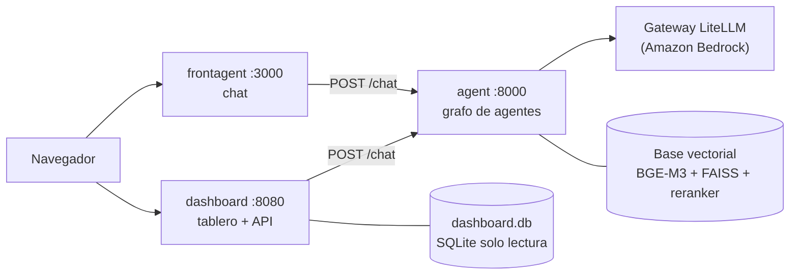

# AeroCode — análisis estratégico multiagente con evidencia trazable

Un asistente conversacional y un tablero de analítica visual sobre un corpus de 1.825 documentos
en tres idiomas. Cada cifra que el sistema muestra se puede abrir hasta el fragmento de documento
del que salió. No hay puntajes de riesgo inventados ni índices compuestos: solo conteos,
frecuencias y agregaciones sobre lo que realmente dicen las fuentes.

Construido para el **CODEFEST AD ASTRA 2026** (Fuerza Aérea Colombiana · Uniandes · Aval Digital
Labs), donde cubre tres fenómenos: inteligencia artificial en defensa (F1), seguridad del entorno
espacial (F2) y dinámicas territoriales en América Latina (F3).

**Tablero en vivo: <https://dashboard.aerocode.codefest2026.augusta.avaldigitallabs.com>**

Escriba una instrucción en lenguaje natural —«¿dónde hay minería ilegal?», «muéstrame la evidencia
satelital»— y un agente decide qué visualización activar y con qué filtros poblarla.

---

## Contenido

- [El problema y el enfoque](#el-problema-y-el-enfoque)
- [Arquitectura](#arquitectura)
- [Cinco decisiones de diseño que definieron el sistema](#cinco-decisiones-de-diseño-que-definieron-el-sistema)
- [La base de conocimiento vectorial](#la-base-de-conocimiento-vectorial)
- [El tablero: de una frase a una visualización](#el-tablero-de-una-frase-a-una-visualización)
- [Seguridad](#seguridad)
- [Trazabilidad, y los huecos que no tapamos](#trazabilidad-y-los-huecos-que-no-tapamos)
- [Resultados medidos](#resultados-medidos)
- [Estructura del repositorio](#estructura-del-repositorio)
- [Levantarlo en local](#levantarlo-en-local)
- [Pruebas y CI](#pruebas-y-ci)
- [Licencia](#licencia)

---

## El problema y el enfoque

Un analista tiene 1.825 documentos heterogéneos —informes en PDF, páginas web, hojas de cálculo,
imágenes satelitales— en español, inglés y portugués. Quiere preguntar en su idioma y obtener una
respuesta con las fuentes a la vista, o ver el panorama en un mapa sin aprender la estructura de
ninguna base de datos.

Las dos restricciones que marcaron el diseño:

1. **Nada inventado.** Un modelo generativo que estima un «índice de riesgo» produce un número con
   apariencia de dato y sin nada detrás. Aquí el modelo **nunca calcula**: elige una ruta o un
   componente de un catálogo cerrado, y el backend ejecuta SQL estático sobre conteos reales.
2. **Todo rastreable.** Cada afirmación del chat cita `[n]`; cada punto del tablero lleva sus pares
   `doc_id` + `chunk_id`. Desde un municipio pintado en el mapa se llega al párrafo exacto.

## Arquitectura

Tres contenedores autosuficientes y un grafo de estados sin ciclos.



El agente es un `StateGraph` de LangGraph **sin ciclos ni autocrítica**. Participan nueve nodos, y
**cinco no cuestan una sola llamada al modelo**:

| Nodo                   | Tipo         | Modelo            | Llamadas                                | Responsabilidad                                                         |
| ---------------------- | ------------ | ----------------- | --------------------------------------- | ----------------------------------------------------------------------- |
| `guarda`               | determinista | —                 | 0                                       | Dos niveles: rechazo duro o aislamiento del texto hostil                |
| `memoria`              | determinista | —                 | 0                                       | Reescribe la consulta de búsqueda de un seguimiento con el turno previo |
| `enrutador`            | embeddings   | BGE-M3 ya cargado | 0                                       | Similitud coseno contra prototipos de ruta                              |
| `orquestador`          | LLM          | Qwen3-Next-80B    | 1, **solo si el enrutador se abstiene** | Clasifica la intención y reformula                                      |
| `planner`              | determinista | —                 | 0                                       | Parte una pregunta compuesta en ≤3 subpreguntas                         |
| `agente_corpus`        | LLM          | Llama 3.3 70B     | 1                                       | Recupera, sanea, redacta citando, se abstiene sin evidencia             |
| `verificador_citas`    | determinista | —                 | 0                                       | Valida cada `[n]` contra el contexto y borra las inventadas             |
| `agente_visualizacion` | LLM          | Qwen3-Next-80B    | 1                                       | Elige componente del catálogo cerrado y sus filtros                     |
| `agente_satelital`     | LLM          | Qwen3-Next-80B    | 1, solo esa ruta                        | Hectáreas **medidas sobre imagen**, no recuperadas                      |

Flujo de una consulta de punta a punta:

```
pregunta
 → guarda        (0 llamadas)  ── rechazo duro ──► respuesta, 0 tokens
 → memoria       (0, solo si el cliente manda `sesion`)
 → enrutador     (0)  ── con confianza ──► ruta
                      └─ sin confianza ──► orquestador (1 llamada) ──► ruta
 → ruta:
    corpus / ambos / visualizacion → agente_corpus (1 llamada)
        planificar_consulta → buscar_corpus → escanear_fragmentos
        → calificar_evidencia → redactar
        → verificador_citas (0)
            · ruta corpus       → respuesta
            · ruta ambos/visual → agente_visualizacion (1 llamada) → respuesta
    satelital         → agente_satelital (1 llamada) → respuesta
    fuera_de_alcance  → texto fijo, 0 llamadas
```

Ningún modelo tiene herramientas peligrosas: no ejecuta código, no genera SQL, no hace peticiones
de red arbitrarias, y ningún secreto es alcanzable desde un prompt.

## Cinco decisiones de diseño que definieron el sistema

### 1. Enrutar con embeddings en vez de con un LLM

La versión inicial pasaba **toda** pregunta por un orquestador LLM que clasificaba la intención y
reformulaba la consulta. Sustituirlo por similitud coseno contra prototipos de ruta —usando el
encoder BGE-M3 que ya está cargado en memoria, coste cero— dio la mayor mejora del proyecto:

|                            | Antes (`baseline`) | Después (`router_v3`) |
| -------------------------- | ------------------ | --------------------- |
| Interacciones por pregunta | 1,82               | **1,00**              |
| Latencia media             | 6.439 ms           | **4.151 ms**          |
| Tokens por pregunta        | 2.807              | **2.627**             |
| Calidad global             | 0,8385             | **0,8754**            |

Lo contraintuitivo: **la calidad subió al quitar un modelo del camino**. El orquestador reformulaba
la consulta y en el proceso perdía matices que la búsqueda necesitaba.

La calibración también enseñó algo: la **confianza absoluta** del enrutador no discrimina, el
**margen** contra el segundo prototipo sí. Las 50 preguntas oficiales dan margen 0,060–0,256; las
preguntas fuera de alcance mal rankeadas, 0,015–0,028. Con el umbral en el margen, el enrutador
resuelve **50 de 50** sin llamar al modelo; antes de calibrar resolvía 4.

### 2. El grafo de entidades pesa 0,3, y decimos por qué

Se construyó un grafo de 26.961 entidades y 97.182 relaciones, y entra en la fusión RRF como un
ranking más. Con peso pleno **empeoraba el sistema**: ordenar por co-ocurrencia de entidades en
lugar de por relevancia semántica expulsaba del top-3 los documentos que respondían la consulta.
Con el peso calibrado a 0,3 su contribución positiva es real pero modesta: **altera 2 de las 50
consultas**.

En el agente de la Etapa 2 el grafo está directamente **apagado**, porque no se midió qué aporta
allí ni qué cuesta. Un componente construido que no se usa es más honesto que uno encendido sin
evidencia.

### 3. Cambiar el reranker: de 25 s a 2 s

El cross-encoder `bge-reranker-v2-m3` consumía 22 de los 23 segundos de cada consulta en el
contenedor CPU. Sustituirlo por `mmarco-mMiniLMv2-L12-H384-v1` sobre 40 candidatos bajó la
recuperación completa de **25–29 s a 1,6–2,1 s**.

### 4. Un ataque no siempre se bloquea: a veces se aísla

La guarda tiene dos niveles, y el segundo es el interesante:

- **Rechazo duro** para credenciales, entorno o ejecución de código: respuesta cortés, **0 llamadas
  y 0 tokens**.
- **Aislamiento** para todo lo demás: **no bloquea**. La pregunta sigue el flujo normal, ya
  delimitada como dato no confiable en los tres prompts, y el intento queda en la traza.

El motivo es de dominio: este corpus está lleno de palabras gatillo legítimas —ataque, arma,
antisatélite, drones, comando—. Bloquear por si acaso cuesta relevancia y tono en preguntas
válidas, mientras que un ataque neutralizado no cuesta nada. La métrica estándar de resistencia
cuenta como resistido tanto rechazar como **ignorar** la instrucción inyectada.

### 5. Un gráfico en blanco es indistinguible de un fallo

Al medir el tablero contra los contenedores reales, **3 de 24 instrucciones producían una vista
completamente vacía**: HTTP 200, cero filas, ningún error. El sistema no sabía que estaba fallando.

La causa era mundana y reveladora: el grafo guarda las entidades en minúscula y SQLite compara
distinguiendo mayúsculas, así que **todo nombre propio escrito como lo escribe una persona**
—`"FARC"`, `"Minería ilegal"`— devolvía un conjunto vacío. Tres reglas lo cerraron:

1. Los vocabularios admitidos viajan **dentro del prompt**, así el agente no inventa valores.
2. Los filtros se resuelven **en el servidor**, sin mayúsculas ni tildes y con coincidencia parcial.
3. Un filtro que no existe **se descarta y se informa** en `filtros_ignorados`, en lugar de vaciar
   la vista.

Tres corridas en frío después: **24/24 producen especificación, 24/24 mueven la interfaz, 0 vistas
en blanco, 0 errores de consola**.

## La base de conocimiento vectorial

Recuperación densa multilingüe **sin generación** (el código vive en
[`etapa1-base-vectorial/`](etapa1-base-vectorial/)). El pipeline de indexación, offline:

1. **Extracción.** Docling con caída automática a PyMuPDF para PDF, trafilatura para HTML, pandas
   para hojas de cálculo, OCR para 51 PDFs escaneados, pyosmium para PBF. Docling aporta **+13 % de
   contenido** y recupera tablas que el extractor simple pierde.
2. **Limpieza.** NFC, caracteres de control, líneas de índice, boilerplate repetido,
   des-hifenación.
3. **Chunking de dos niveles.** Ventanas de 384 tokens para _codificar_; sub-fragmentos de ≤250
   palabras con oraciones completas para _presentar_. Segmentación oracional multilingüe.
4. **Codificación.** `BAAI/bge-m3` (MIT, español/inglés/portugués nativo, denso y léxico en una
   sola pasada) → índice FAISS + índice disperso + metadatos. NER con GLiNER y co-ocurrencia → el
   grafo.

El índice es un **`IndexFlatIP` normalizado**: coseno **exacto** sobre 90.613 vectores de 1.024
dimensiones. Se descartaron IVFFlat y HNSW porque cambian exactitud por velocidad de búsqueda, y
aquí la exactitud es lo que se juzga.

En consulta:

```
consulta → denso (FAISS) + disperso (léxico BGE-M3) + grafo
        → fusión RRF ponderada (k₀ = 60, 100 candidatos por índice)
        → rerank cross-encoder
        → 10 fragmentos + 3 documentos (agregación max_pool)
```

RRF opera sobre **posiciones** en vez de sobre puntuaciones, así que es robusto a que cada encoder
use una escala distinta. La agregación por documento usa `max_pool` y no `sum` porque `sum` premia
a los documentos largos con muchos fragmentos mediocres — medido peor en dos corpus distintos.

**El corpus:**

|                                         |                                  |
| --------------------------------------- | -------------------------------- |
| Documentos                              | 1.825 (459 F1 · 478 F2 · 888 F3) |
| Fragmentos                              | 90.613                           |
| Entidades / menciones                   | 26.961 / 190.445                 |
| Relaciones del grafo                    | 97.182                           |
| Menciones de país → ISO3                | 17.351                           |
| Alertas Defensoría (alerta × municipio) | 1.082                            |

La base vectorial construida pesa 507 MB comprimidos y viaja como
[release](../../releases/tag/base-vectorial-v1) porque `index.faiss` (354 MB) y `metadata.jsonl`
(190 MB) superan el límite por archivo de GitHub. El pipeline es reproducible: `resultados.jsonl`
se regenera **byte a byte** (MD5 `39d4eee2eb7bb13d12bd51c39844a5a0`), con semilla fija en random,
numpy y torch.

> **Una limitación que conviene decir en voz alta.** Las 50 consultas oficiales no traen juicios de
> relevancia, así que NDCG@10 y F1@3 **no se pueden calcular** sobre ellas. Ninguna cifra de este
> repositorio afirma que una configuración sea mejor que otra en la métrica del reto. El control de
> calidad es un verificador de cinco comprobaciones —esquema, coherencia temática, documentos
> omnipresentes, diversidad de fuentes, fragmentos degenerados— y fue lo que detectó el peor defecto
> del proyecto: **el PDF con las 50 consultas se había indexado como un documento más del corpus y
> aparecía en el top-3 de 20 de ellas**.

## El tablero: de una frase a una visualización

```
instrucción → POST /api/visualizar → el agente elige componente + filtros (catálogo cerrado)
  → el backend resuelve los filtros contra el vocabulario real
  → ejecuta SQL estático parametrizado
  → {datos, evidencia:[{doc_id, chunk_id}], nota_metodo, total_evidencia, filtros_ignorados}
```

Toda respuesta con datos lleva su evidencia, cada dato clicable lleva hasta 20 referencias propias,
y `nota_metodo` explica en una frase cómo se calculó el valor.

**Los doce componentes** (diez de ellos proponibles por el agente; los dos últimos solo por
selector o URL):

| Componente               | Qué muestra                                                                                |
| ------------------------ | ------------------------------------------------------------------------------------------ |
| `mapa_colombia`          | Coropleta por departamento o municipio: alertas tempranas, economías ilícitas              |
| `mapa_mundo`             | Menciones de países sobre mapa mundial                                                     |
| `red_entidades`          | Grafo de entidades con vecinos expandibles; layouts de fuerzas, radial y niveles           |
| `matriz_calor`           | Cruce de dos categóricas; las filas son siempre _lo que se menciona_, las columnas _dónde_ |
| `linea_tiempo`           | Documentos por año y reaparición de una entidad                                            |
| `cuadrante_priorizacion` | Intensidad (conteo) frente a tendencia (variación), **sin índice compuesto**               |
| `composicion_corpus`     | Documentos por fenómeno, organización, formato e idioma                                    |
| `panel_evidencia`        | Fragmentos originales con `doc_id`/`chunk_id`                                              |
| `evidencia_satelital`    | Tríptico ortomosaico + predicción + anotación humana, con hectáreas medidas                |
| `deforestacion`          | Hectáreas de bosque perdidas en el Chocó por municipio y causa, 2014-2021                  |
| `distribucion`           | Histograma de cinco variables, cola larga agrupada, recorte en P99                         |
| `poblacion_orbital`      | Crecimiento orbital por tipo y país, desechos ASAT, los 3 objetos de Colombia              |

El estado vive en la URL, así que cualquier vista es un enlace reproducible. El modo **Presentar**
recorre con las flechas los turnos de conversación que produjeron cada vista, sin volver a llamar
al agente: una narrativa guiada cuya secuencia la escribe quien pregunta.

### La evidencia satelital, y por qué no se mezclan las fuentes

Dos fuentes independientes, nunca combinadas: **Amazon Mining Watch** (Sentinel-2, 10 m/px,
Colombia amazónica, serie 2018–2026) y **ELDOR** (ortomosaico de dron a 5 cm/px en Madre de Dios,
Perú, segmentado con SegFormer MiT-B2 y validado contra máscaras anotadas a mano).

Una pregunta sobre Colombia nunca arrastra sitios peruanos. La razón es medida: el modelo de ELDOR
se derrumba por debajo de ~0,30 m/px, y la mejor imagen colombiana disponible es de 0,59 m/px — a
esa resolución etiqueta casi todo como agua.

## Seguridad

El atacante controla el texto de la pregunta y, de forma indirecta, el contenido de los documentos
recuperados. Las capas, de fuera hacia dentro:

1. **Normalización Unicode** NFKC y eliminación de caracteres de control y de ancho cero.
2. **25 patrones de alta precisión** en español, inglés y portugués, que exigen que la orden se
   dirija al asistente («tus reglas», «a partir de ahora eres…»). `DAN` solo dispara en mayúsculas,
   para no bloquear «¿qué beneficios **dan**…?».
3. **Clasificador** `proventra/mdeberta-v3-base-prompt-injection` en CPU (~27 ms por texto), y solo
   si los patrones no vieron nada.
4. **Separación instrucción/datos**: la pregunta y los fragmentos viajan entre delimitadores
   `<<DATOS_NO_CONFIABLES …>>`, y los delimitadores que aparezcan en el texto se sustituyen para que
   nadie pueda cerrarlos desde dentro.
5. **Saneamiento de fragmentos**: neutraliza el tramo sospechoso **sin descartar el fragmento
   completo** — un informe que _describe_ un ataque de inyección no es un ataque.
6. **Saneamiento de salida**: cualquier respuesta con nombres de credenciales, claves o marcas
   internas del prompt se reemplaza por el rechazo.

| Medición                                                      | Resultado                                                                                                       |
| ------------------------------------------------------------- | --------------------------------------------------------------------------------------------------------------- |
| Batería propia de 30 ataques                                  | **30/30 resistidos** (5 rechazo duro, 18 aislados sin bloquear)                                                 |
| Falsos positivos sobre 20 preguntas fuera de alcance          | **0 %**                                                                                                         |
| Batería dura de 24 ataques sin palabras gatillo (ES/EN/PT/FR) | patrones solos 4/24 · patrones + clasificador **15/24**                                                         |
| Clasificadores descartados                                    | `deberta-v3-v2` (4 falsos positivos, solo inglés) · `wolf-defender` (923 ms/texto) · `mmbert32k` (4/20 ataques) |
| Guardarraíl con LLM juez                                      | descartado **por diseño**: una llamada extra en cada pregunta                                                   |

Además: SQLite en solo lectura, SQL 100 % estático con parámetros nombrados —incluso los nombres de
columna se eligen con `CASE`, de modo que una inyección en un filtro **solo puede producir un
resultado vacío**, y hay una prueba que lo verifica—, contenedores con usuario sin privilegios, y
un sistema sin estado en el que una inyección no puede persistir entre peticiones.

> **Estas baterías son propias: son un piso, no una nota.** Nasr, Carlini y Tramèr (2025) muestran
> que los ataques adaptativos rompen la mayoría de las defensas publicadas. Nada de lo medido aquí
> autoriza a decir que el sistema es seguro frente a un atacante dedicado.

## Trazabilidad, y los huecos que no tapamos

`chunk_id` es el número de fila de `metadata.jsonl`, que es la misma numeración interna de FAISS.
Gracias a eso la tabla de fragmentos del tablero es una fila por línea de metadatos, consistente con
el agente **sin ninguna traducción intermedia**. El campo `tools_called` registra qué hizo el
sistema —no solo qué dijo— en el momento en que ocurre, no reconstruido después.

Los huecos de los datos se muestran en vez de rellenarse:

- **1.277 de 1.825 documentos (70 %) no traen fecha completa.** La línea de tiempo grafica solo los
  845 que sí, y el eje dice «documentos con fecha», no «documentos».
- **232 de 528 nodos de tipo país no resuelven a un código ISO3** (siglas, gentilicios, trozos de
  frase). El mapa pinta los 296 que sí y **descarta el resto en lugar de adivinar**.
- **1 de 1.082 alertas** («Santa Cruz de Mompox») no empareja con DIVIPOLA y queda fuera de la
  coropleta: preferimos perder un dato a inventar su ubicación.
- Se descartaron el mapa de puntos y el de densidad **por principio**: ninguna fuente trae
  coordenadas —la unidad es el polígono— y un centroide sería una coordenada que nadie midió,
  presentada con la precisión visual de un dato observado.

## Resultados medidos

Tres corridas completas sobre las 50 preguntas oficiales, mismo endpoint y mismo modelo juez:

| Métrica                    | `baseline` | `router_v2` | `router_v3` (final) |
| -------------------------- | ---------- | ----------- | ------------------- |
| Calidad global             | 0,8385     | 0,8717      | **0,8754**          |
| Relevancia                 | 0,7486     | 0,8141      | **0,8278**          |
| Fidelidad                  | 0,9265     | **0,9667**  | 0,9319              |
| Interacciones por pregunta | 1,82       | 1,84        | **1,00**            |
| Tokens por pregunta        | 2.807      | 2.862       | **2.627**           |
| Latencia media             | 6.439 ms   | 6.733 ms    | **4.151 ms**        |
| Latencia p95               | 7.935 ms   | 8.268 ms    | **5.365 ms**        |
| Resistencia a ataques      | 100 %      | 100 %       | **100 %**           |
| Falsos positivos           | 0 %        | 0 %         | **0 %**             |

Otras cifras verificadas:

|                                                |                                                               |
| ---------------------------------------------- | ------------------------------------------------------------- |
| Recuperación completa tras cambiar el reranker | 25–29 s → **1,6–2,1 s**                                       |
| Preguntas resueltas sin llamar al orquestador  | **50/50**                                                     |
| Arranque en frío · modelos en RAM              | ~20 s · ~2,6 GB                                               |
| Latencia de los componentes del tablero        | **< 500 ms**, verificado por prueba                           |
| Acierto de componente del tablero              | **20–22 de 24**, no estable entre corridas                    |
| Calificación de evidencia                      | mediana +4,48 en preguntas del corpus, −2,14 fuera de alcance |
| Activación del planner                         | 3 de 50 preguntas, y las tres son compuestas de verdad        |

El acierto del tablero se cita con rango a propósito: **no es estable entre corridas con el mismo
prompt**, y los desaciertos son siempre los mismos tres casos. Uno de ellos es un fallo real que se
decidió **no arreglar**, porque tocar ese prompt arriesgaba la calidad del chat, ya congelado.

## Estructura del repositorio

```
.
├── agent/                   # sistema multiagente (FastAPI + LangGraph), puerto 8000
│   ├── app/                 #   graph.py, agents.py, router.py, guard.py, catalogo.py
│   ├── etapa1/              #   recuperador embebido, reducido a consultar la base
│   ├── eval/resultados/     #   las corridas de evaluación citadas arriba
│   └── tests/               #   110 pruebas
├── frontagent/              # consola de chat (Next.js 16), puerto 3000
├── dashboard/               # tablero en un solo contenedor, puerto 8080
│   ├── api/                 #   FastAPI: los 12 componentes, evidencia, visualizar
│   ├── datos/               #   preparar.py → dashboard.db y geo/*.geojson
│   └── web/                 #   SPA Vite + React 19 (ECharts, MapLibre GL, d3-force)
├── etapa1-base-vectorial/   # construcción de la base vectorial, con su historia completa
│   ├── src/                 #   extracción, limpieza, chunking, codificación, grafo
│   └── eval_interno/        #   evaluación sobre las 50 consultas
├── docs/
│   ├── ARQUITECTURA.md      #   el documento largo: cada decisión y su porqué
│   ├── ARQUITECTURA_DESPLIEGUE_SEGURIDAD.md
│   └── investigacion/       #   estado del arte y análisis de los tres fenómenos
├── tests/e2e/               # Playwright sobre las dos superficies
└── .github/workflows/ci.yml
```

Cada componente tiene su propio README: [`agent/`](agent/README.md),
[`frontagent/`](frontagent/README.md), [`dashboard/`](dashboard/README.md) con el contrato en
[`dashboard/API.md`](dashboard/API.md), [`etapa1-base-vectorial/`](etapa1-base-vectorial/README.md)
y [`tests/e2e/`](tests/e2e/README.md).

## Levantarlo en local

Hace falta Docker y una clave para un gateway compatible con la API de OpenAI.

```bash
docker network create aerocode

docker build -t aerocode-agent ./agent
docker run -d --name agent --network aerocode -p 8000:8000 \
  -e LLM_API_KEY="$LLM_API_KEY" aerocode-agent

docker build -t aerocode-dashboard ./dashboard
docker run -d --name dashboard --network aerocode -p 8080:8080 \
  -e AGENT_URL=http://agent:8000 -e CONSOLA_URL=http://localhost:3000 aerocode-dashboard

docker build -t aerocode-frontagent ./frontagent
docker run -d --name frontagent --network aerocode -p 3000:3000 \
  -e AGENT_URL=http://agent:8000 -e DASHBOARD_URL=http://localhost:8080 aerocode-frontagent
```

Chat en `localhost:3000` · tablero en `localhost:8080` · salud del agente en
`localhost:8000/health`. La construcción del agente descarga los tres modelos y la base vectorial,
así que tarda varios minutos. El arranque en frío tarda ~20 s más: una petición que llegue antes
**espera** en lugar de recibir un 503.

El despliegue real corre sobre Coolify con Traefik y Let's Encrypt; el procedimiento está en
[`docs/ARQUITECTURA_DESPLIEGUE_SEGURIDAD.md`](docs/ARQUITECTURA_DESPLIEGUE_SEGURIDAD.md).

## Pruebas y CI

| Suite             | Pruebas | Qué cubre                                                                                                                                  |
| ----------------- | ------- | ------------------------------------------------------------------------------------------------------------------------------------------ |
| Agente            | 110     | Contrato, rutas del grafo, número de llamadas, abstención, guarda, enrutador, verificador de citas, regresión de caché                     |
| API del tablero   | 54      | Cada componente devuelve datos con evidencia real; filtros inválidos y cargas de inyección SQL no rompen nada; todos responden en < 500 ms |
| Datos del tablero | 11      | Cada `chunk_id` existe y su `doc_id` coincide; DIVIPOLA válido; sin fechas futuras                                                         |
| Base vectorial    | 65      | Chunking, fusión, agregación, esquema estricto, determinismo                                                                               |
| E2E (Playwright)  | ~52     | Las dos superficies en perfil escritorio y móvil                                                                                           |

Las pruebas E2E **nunca invocan un modelo**: las peticiones al agente se sirven siempre desde
grabaciones reales, y una doble guardia lo impone —una ruta aborta cualquier petición no simulada, y
al cerrar cada prueba se verifica que toda petición observada estuvo simulada—. Si alguien añade una
prueba que olvida simular, la prueba falla en lugar de gastar cuota. El resto sí corre en vivo
contra los contenedores. Incluyen auditoría de accesibilidad **axe (WCAG 2.x A/AA)** que falla ante
violaciones serias o críticas.

El CI ejecuta cuatro trabajos en paralelo en cada push y cada PR: `ruff`, `bandit` y `pytest` para
el agente —con dependencias ligeras, sin torch ni FAISS, gracias a los imports diferidos— y para la
API del tablero, `ruff` para el preparador de datos, y `eslint` para los dos frontends.

## Créditos y licencia

Desarrollado por el equipo **AeroCode** para el CODEFEST AD ASTRA 2026.

Publicado bajo **AGPL-3.0** — ver [LICENSE](LICENSE).

El corpus documental es propiedad de Aval Digital Labs y **no se redistribuye** en este repositorio:
solo viajan los metadatos, las consultas de evaluación y los artefactos derivados que la licencia
permite.
