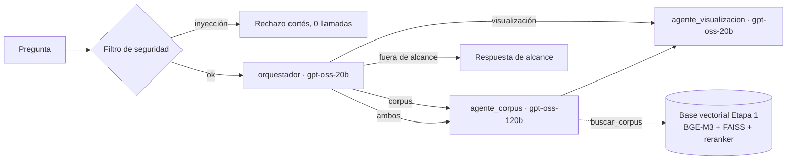

# Agente del Reto 1

Sistema multiagente que responde preguntas sobre los tres fenómenos (IA y capacidades estratégicas,
seguridad del entorno espacial y dinámicas territoriales en América Latina). Se expone en un único
puerto HTTP, como exige el Anexo A.4.

| Endpoint          | Uso                                                                                                                 |
| ----------------- | ------------------------------------------------------------------------------------------------------------------- |
| `POST /chat`      | Pregunta en texto plano o en JSON (`pregunta`, `question`, `input`, `query`…). Responde con el contrato de la §2.4. |
| `GET /health`     | _Healthcheck_ del contenedor. Informa si la base vectorial ya terminó de cargar.                                    |
| `GET /agent-card` | Ficha del sistema multiagente (§2.3).                                                                               |

## Arquitectura



- **Eficiencia (§2.5.2):** la ruta típica hace dos llamadas al modelo. El filtro de seguridad
  rechaza los intentos de inyección sin llamar a ningún modelo. El agente de corpus se abstiene sin
  llamar al redactor cuando no encuentra evidencia.
- **Fidelidad (§2.5.1):** el redactor recibe solo 6 fragmentos numerados y debe citarlos. Esos
  mismos fragmentos se devuelven en `evaluacion.retrieval_context`.
- **Trazabilidad:** cada fragmento conserva su `doc_id` y `chunk_id`. El frontend propio los recibe
  en `extras.citas` enviando `"incluir_extras": true`. La evaluación automática no los pide y recibe
  el contrato exacto.

| Módulo             | Responsabilidad                                               |
| ------------------ | ------------------------------------------------------------- |
| `app/contract.py`  | Contrato de respuesta de la §2.4                              |
| `app/graph.py`     | Grafo LangGraph y armado de la respuesta                      |
| `app/agents.py`    | Orquestador, agente de corpus y agente de visualización       |
| `app/prompts.py`   | Prompts de sistema                                            |
| `app/catalogo.py`  | Catálogo cerrado de componentes visuales del Reto 2           |
| `app/guard.py`     | Defensas contra _prompt injection_                            |
| `app/llm.py`       | Cliente de Bedrock, con conteo real de tokens y tope de gasto |
| `app/tracker.py`   | Contabilidad de llamadas, tokens, herramientas y latencia     |
| `app/retrieval.py` | Adaptador de la base vectorial de la Etapa 1                  |
| `etapa1/`          | Código de recuperación traído de la Etapa 1 (ver su README)   |

## Variables de entorno

Se declaran en Coolify, en _Environment Variables_. **Nunca** se escriben en el código ni en la
imagen.

| Variable                   | Por defecto               | Descripción                                                                                 |
| -------------------------- | ------------------------- | ------------------------------------------------------------------------------------------- |
| `AWS_BEARER_TOKEN_BEDROCK` | —                         | API Key de Bedrock entregada por ADL (**obligatoria**)                                      |
| `AWS_REGION`               | `us-east-1`               | Región de Bedrock                                                                           |
| `MODELO_ORQUESTADOR`       | `openai.gpt-oss-20b-1:0`  | ID de modelo del orquestador                                                                |
| `MODELO_CORPUS`            | `openai.gpt-oss-120b-1:0` | ID de modelo del agente de corpus                                                           |
| `MODELO_VISUALIZACION`     | `openai.gpt-oss-20b-1:0`  | ID de modelo del agente de visualización                                                    |
| `PRESUPUESTO_TOKENS`       | `40000000`                | Tope de tokens del proceso, para proteger la bolsa de USD 100                               |
| `BASE_VECTORIAL_DIR`       | `/data/base_vectorial`    | Ruta de la base vectorial                                                                   |
| `FRAGMENTOS_CONTEXTO`      | `6`                       | Fragmentos que recibe el redactor                                                           |
| `GRAFO_EN_RECUPERACION`    | `false`                   | Integra el grafo en la recuperación. Carga GLiNER, así que antes hay que medir la latencia. |
| `CORS_ORIGINS`             | `*`                       | Orígenes permitidos (frontagent y dashboard)                                                |

> **Pendiente:** confirmar los IDs de modelo en la consola de Bedrock y elegirlos con los
> benchmarks de `docs/investigacion/03_arquitectura/benchmarks_modelos_bedrock.md`. La ficha
> `agent_card.json` debe declarar los mismos modelos, porque el costo por pregunta se calcula con
> ellos (§2.3).

## Desarrollo local

```bash
cd agent
python -m venv .venv && .venv/Scripts/activate      # Linux/macOS: source .venv/bin/activate
pip install torch --index-url https://download.pytorch.org/whl/cpu
pip install -r requirements-dev.txt
pytest                      # pruebas del flujo y del contrato
ruff check . && bandit -q -r app etapa1
```

Para correr el servicio con datos reales hay que apuntar `BASE_VECTORIAL_DIR` a la base de la
Etapa 1 y definir la API Key:

```bash
BASE_VECTORIAL_DIR=../../ANDES/entrega/base_vectorial RETRIEVAL_CONFIG=config.retrieval.yaml \
  uvicorn app.main:app --port 8000
curl -X POST localhost:8000/chat -H "Content-Type: text/plain" -d "¿Qué es el síndrome de Kessler?"
```

## Docker y Coolify

```bash
docker build -t agente ./agent
docker run -p 8000:8000 -e AWS_BEARER_TOKEN_BEDROCK=... agente
```

En Coolify se usa el build pack **Dockerfile**, con _Base Directory_ `/agent`, puerto `8000` y el
dominio `agent.<equipo>.codefest2026.augusta.avaldigitallabs.com`.

La imagen incluye los modelos BGE-M3 y bge-reranker-v2-m3 y la base vectorial, que se descarga del
release público de la Etapa 1. El contenedor corre con un usuario sin privilegios.
