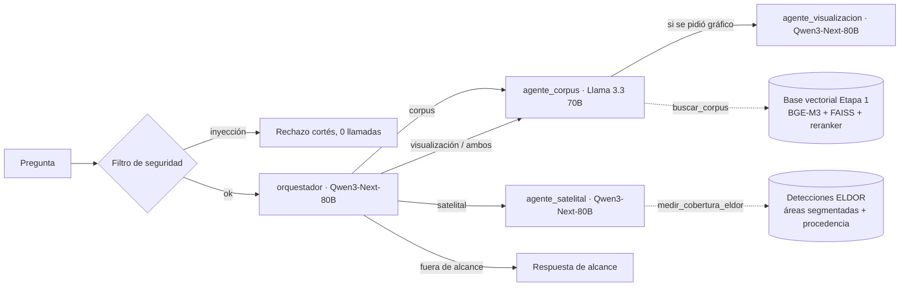

# Agente del Reto 1

Sistema multiagente que responde preguntas sobre los tres fenómenos (IA y capacidades estratégicas,
seguridad del entorno espacial y dinámicas territoriales en América Latina). Se expone en un único
puerto HTTP, como exige el Anexo A.4.

| Endpoint          | Uso                                                                                                                 |
| ----------------- | ------------------------------------------------------------------------------------------------------------------- |
| `POST /chat`      | Pregunta en texto plano o en JSON (`pregunta`, `question`, `input`, `query`…). Responde con el contrato de la §2.4. |
| `GET /health`     | _Healthcheck_ del contenedor. Informa si la base vectorial ya terminó de cargar.                                    |
| `GET /agent-card` | Ficha del sistema multiagente (§2.3).                                                                               |

## Arquitectura



- **Eficiencia (§2.5.2):** la ruta típica hace dos llamadas al modelo. El filtro de seguridad
  rechaza los intentos de inyección sin llamar a ningún modelo. El agente de corpus se abstiene sin
  llamar al redactor cuando no encuentra evidencia.
- **Fidelidad (§2.5.1):** el redactor recibe solo 6 fragmentos numerados y debe citarlos. Esos
  mismos fragmentos se devuelven en `evaluacion.retrieval_context`. **Toda ruta que responda con
  contenido pasa por el corpus**, incluidas las peticiones de gráfico: así el contexto nunca va
  vacío (la fidelidad no se puede medir contra un contexto vacío) y una pregunta de corpus mal
  enrutada no se pierde. La especificación del gráfico viaja en `extras.visualizacion`, no dentro
  de `respuesta`, para no meter en `actual_output` afirmaciones que el contexto no sustenta.
- **Trazabilidad:** cada fragmento conserva su `doc_id` y `chunk_id`. El frontend propio los recibe
  en `extras.citas` enviando `"incluir_extras": true`. La evaluación automática no los pide y recibe
  el contrato exacto.

- **Agente satelital (opcional).** Cuarto agente: responde con áreas medidas al segmentar
  ortomosaicos de dron de minas de oro amazónicas con el modelo ELDOR. Las cifras se calculan
  fuera de línea (`scripts/eldor_precalcular.py`) y aquí solo se leen, así que la latencia del
  chat no cambia y la imagen no carga `torch`. Su trazabilidad no es `doc_id`/`chunk_id` sino
  sitio + CRS + rectángulo geográfico + fecha de vuelo + checkpoint. Si no hay detecciones en
  `datos/eldor/`, el agente no se registra y la ruta cae al corpus. Viabilidad, métricas medidas
  y límites: [`docs/investigacion/03_arquitectura/deteccion_satelital_eldor.md`](../docs/investigacion/03_arquitectura/deteccion_satelital_eldor.md).

| Módulo             | Responsabilidad                                               |
| ------------------ | ------------------------------------------------------------- |
| `app/contract.py`  | Contrato de respuesta de la §2.4                              |
| `app/graph.py`     | Grafo LangGraph y armado de la respuesta                      |
| `app/agents.py`    | Orquestador, agente de corpus y agente de visualización       |
| `app/planner.py`   | Descomposición determinista de preguntas compuestas           |
| `app/memoria.py`   | Memoria conversacional por sesión, opcional                   |
| `app/prompts.py`   | Prompts de sistema                                            |
| `app/catalogo.py`  | Catálogo cerrado de componentes visuales del Reto 2           |
| `app/guard.py`     | Defensas contra _prompt injection_                            |
| `app/llm.py`       | Cliente de Bedrock, con conteo real de tokens y tope de gasto |
| `app/tracker.py`   | Contabilidad de llamadas, tokens, herramientas y latencia     |
| `app/retrieval.py` | Adaptador de la base vectorial de la Etapa 1                  |
| `etapa1/`          | Código de recuperación traído de la Etapa 1 (ver su README)   |
| `app/eldor/`       | Detección de minería ilegal sobre imágenes de dron (ELDOR)    |

## Variables de entorno

Se declaran en Coolify, en _Environment Variables_. **Nunca** se escriben en el código ni en la
imagen.

| Variable                   | Por defecto                                                                              | Descripción                                                                                                 |
| -------------------------- | ---------------------------------------------------------------------------------------- | ----------------------------------------------------------------------------------------------------------- |
| `LLM_BASE_URL`             | gateway de ADL (`https://litellm.admin-adl.codefest2026.augusta.avaldigitallabs.com/v1`) | URL base del gateway OpenAI-compatible de ADL (`https://…/v1`). Si está definida, se usa en lugar de boto3. |
| `LLM_API_KEY`              | —                                                                                        | Clave `sk-…` entregada por ADL para el gateway (**obligatoria con el gateway**)                             |
| `AWS_BEARER_TOKEN_BEDROCK` | —                                                                                        | API Key nativa de Bedrock (solo si no se usa el gateway)                                                    |
| `AWS_REGION`               | `us-east-1`                                                                              | Región de Bedrock                                                                                           |
| `MODELO_ORQUESTADOR`       | `qwen3-next-80b`                                                                         | ID de modelo del orquestador                                                                                |
| `MODELO_CORPUS`            | `meta.llama3-3-70b-instruct`                                                             | ID de modelo del agente de corpus                                                                           |
| `MODELO_VISUALIZACION`     | `qwen3-next-80b`                                                                         | ID de modelo del agente de visualización                                                                    |
| `MODELO_SATELITAL`         | `qwen3-next-80b`                                                                         | ID de modelo del agente satelital                                                                           |
| `RAZONAMIENTO_GPT_OSS`     | `low`                                                                                    | Esfuerzo de razonamiento de gpt-oss (`low`, `medium`, `high`)                                               |
| `PRESUPUESTO_TOKENS`       | `40000000`                                                                               | Tope de tokens del proceso, para proteger la bolsa de USD 100                                               |
| `BASE_VECTORIAL_DIR`       | `/data/base_vectorial`                                                                   | Ruta de la base vectorial                                                                                   |
| `FRAGMENTOS_CONTEXTO`      | `6`                                                                                      | Fragmentos que recibe el redactor                                                                           |
| `UMBRAL_EVIDENCIA`         | `-0.5`                                                                                   | Score mínimo del cross-encoder para no advertir de evidencia débil. Calibrado sobre la base real                |
| `GRAFO_EN_RECUPERACION`    | `false`                                                                                  | Integra el grafo en la recuperación. Carga GLiNER, así que antes hay que medir la latencia.                 |
| `MODELO_INYECCION`         | `proventra/mdeberta-v3-base-prompt-injection`                                            | Clasificador de la segunda capa de seguridad. Alternativa medida: `meta-llama/Llama-Prompt-Guard-2-86M`     |
| `UMBRAL_INYECCION`         | `0.5`                                                                                    | Probabilidad mínima para tratar la pregunta como ataque                                                     |
| `HF_TOKEN`                 | —                                                                                        | Solo para modelos de acceso restringido (Prompt Guard 2). Va en Coolify, nunca en la imagen ni en el código |
| `AGENTE_SATELITAL`         | `true`                                                                                   | Activa el cuarto agente. Requiere detecciones precalculadas en `datos/eldor/`                               |
| `CORS_ORIGINS`             | `*`                                                                                      | Orígenes permitidos (frontagent y dashboard)                                                                |

### Cambiar el clasificador de inyección

`MODELO_INYECCION` acepta cualquier clasificador binario de inyección de HuggingFace: la
etiqueta de ataque se deduce de `id2label`, así que conviven los que usan
`SAFE`/`INJECTION` y los que usan `LABEL_0`/`LABEL_1`.

El valor por defecto es el que **más detecta en nuestro dominio**. Medido sobre las 50
preguntas oficiales, 14 preguntas legítimas con vocabulario "peligroso" y 24 ataques
difíciles en ES/EN/PT/FR que el filtro de patrones no puede ver:

| Pila                                           | Falsos positivos | Ataques difíciles | Latencia |
| ---------------------------------------------- | ---------------- | ----------------- | -------- |
| patrones + `proventra/mdeberta` (por defecto)  | 0 / 50           | **15/24 (62 %)**  | 245 ms   |
| patrones + `Llama-Prompt-Guard-2-86M`          | 0 / 50           | 8/24 (33 %)       | 220 ms   |
| patrones + ambos                               | 0 / 50           | 15/24 (62 %)      | 450 ms   |

El detalle está en
[`docs/investigacion/03_arquitectura/reranking_y_seguridad.md`](../docs/investigacion/03_arquitectura/reranking_y_seguridad.md) §2.7.
Prompt Guard 2 es de acceso restringido: para usarlo hay que descargarlo **en la
construcción** con un secreto de BuildKit (ver el bloque comentado del `Dockerfile`).
Nunca se pasa el token como `ARG` ni como `ENV`, porque quedaría en `docker history`.

> **Pendiente:** confirmar los IDs de modelo en la consola de Bedrock y elegirlos con los
> benchmarks de `docs/investigacion/03_arquitectura/benchmarks_modelos_bedrock.md`. La ficha
> `agent_card.json` debe declarar los mismos modelos, porque el costo por pregunta se calcula con
> ellos (§2.3).

## Desarrollo local

```bash
cd agent
python -m venv .venv && .venv/Scripts/activate      # Linux/macOS: source .venv/bin/activate
pip install torch --index-url https://download.pytorch.org/whl/cpu
pip install -r requirements-dev.txt
pytest                      # pruebas del flujo y del contrato
ruff check . && bandit -q -r app etapa1
```

Para correr el servicio con datos reales hay que apuntar `BASE_VECTORIAL_DIR` a la base de la
Etapa 1 y definir la API Key:

```bash
BASE_VECTORIAL_DIR=../../ANDES/entrega/base_vectorial RETRIEVAL_CONFIG=config.retrieval.yaml \
  uvicorn app.main:app --port 8000
curl -X POST localhost:8000/chat -H "Content-Type: text/plain" -d "¿Qué es el síndrome de Kessler?"
```

## Docker y Coolify

```bash
docker build -t agente ./agent
docker run -p 8000:8000 -e AWS_BEARER_TOKEN_BEDROCK=... agente
```

En Coolify se usa el build pack **Dockerfile**, con _Base Directory_ `/agent`, puerto `8000` y el
dominio `agent.<equipo>.codefest2026.augusta.avaldigitallabs.com`.

La imagen incluye BGE-M3, el reranker multilingüe ligero mmarco-mMiniLMv2-L12-H384 y la base vectorial, que se descarga del
release público de la Etapa 1. El contenedor corre con un usuario sin privilegios.
