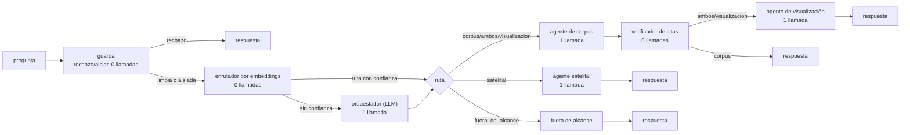

# Arquitectura del sistema — Retos 1 y 2

**Equipo AeroCode · CODEFEST AD ASTRA 2026 · Final (Etapa 2).**

Documento de arquitectura exigido en la §1.4 de la especificación oficial, y donde se
justifica además la propuesta de diseño por fenómeno del Reto 2 (§3.4, bloque A, 40 %
de esa nota). Cubre
agentes, orquestación, herramientas, recuperación, trazabilidad, evaluación,
eficiencia, seguridad y despliegue. Cada decisión lleva su cifra medida y, cuando
aplica, lo que se descartó y por qué.

Se divide en dos partes que se escribieron y verificaron por separado, y se juntan
aquí en un solo documento:

- **Secciones 1 a 5** (este documento): agentes, orquestación, recuperación,
  trazabilidad y evaluación.
- **Secciones 6 y 7**: despliegue, operación y seguridad — contenido íntegro de
  `docs/ARQUITECTURA_DESPLIEGUE_SEGURIDAD.md`, que sigue existiendo por separado como
  fuente y se mantiene sincronizado con estas secciones.

---

## 1. Resumen del sistema

Un agente conversacional que responde preguntas sobre tres fenómenos (IA y
capacidades estratégicas en defensa — F1; seguridad del entorno espacial — F2;
dinámicas territoriales y amenazas regionales en América Latina — F3), con
respuestas citadas y trazables a `doc_id`/`chunk_id` del corpus de la Etapa 1, y que
además puede proponer visualizaciones para un tablero a partir de instrucciones en
lenguaje natural. Ningún modelo generativo tiene acceso a herramientas peligrosas: no
ejecuta código, no hace llamadas de red arbitrarias, solo elige una ruta o un
componente de un catálogo cerrado.



El flujo real es un `StateGraph` de LangGraph sin ciclos ni autocrítica
(`agent/app/graph.py`, clase `Sistema`). La ruta más frecuente hoy resuelve en **una
sola llamada al modelo** (corpus vía enrutador), medido en el harness propio
(§5): interacciones/pregunta = 1,00 sobre las 50 preguntas oficiales.

---

## 2. Agentes y orquestación

### 2.1 Los nueve participantes

| # | Nombre | Tipo | Llamadas al modelo | Rol |
| --- | --- | --- | --- | --- |
| 1 | `guarda` | Determinista | 0 (más el clasificador CPU, no generativo) | Guard de dos niveles: rechazo duro (credenciales, ejecución de código) o aislamiento (todo lo demás), ver §7.2 |
| 2 | `memoria` | Determinista, opcional | 0 | Solo si el cliente manda `sesion`: reescribe la consulta de búsqueda de un seguimiento con el turno previo (§2.6) |
| 3 | `enrutador` (por embeddings) | Determinista | 0 | Clasifica la ruta por similitud coseno contra prototipos, con el BGE-M3 ya cargado para recuperación |
| 4 | `orquestador` | LLM (Qwen3-Next-80B) | 1, solo si el enrutador se abstiene | Camino de excepción: clasifica intención y reformula la consulta cuando el enrutador no tiene confianza suficiente |
| 5 | `planner` | Determinista | 0 | Descompone una pregunta compuesta en hasta 3 subpreguntas y busca cada una por separado (§2.5) |
| 6 | `agente_corpus` | LLM (Llama 3.3 70B) | 1, si hay fragmentos (si no, 0) | Recupera, escanea y sanea fragmentos, redacta citando cada afirmación, se abstiene si la evidencia no alcanza |
| 7 | `verificador_citas` | Determinista | 0 | Corre siempre después del corpus: valida cada marca `[n]` contra el contexto real entregado |
| 8 | `agente_visualizacion` | LLM (Qwen3-Next-80B) | 1 | Elige componente de un catálogo cerrado y sus filtros; el backend calcula los valores |
| 9 | `agente_satelital` | LLM (Qwen3-Next-80B) | 1, solo en la ruta `satelital` | Responde con hectáreas medidas sobre imagen —minería ilegal y cobertura boscosa— en vez de texto recuperado, con su procedencia (§2.7) |

Nueve participantes, **cinco de ellos sin costo de interacción** (0 llamadas al
modelo). El diseño del bloque D (20 % de la nota) se apoya en esto: sumar capacidad al
sistema **sin** sumar coste al bloque B (20 %). Guarda, memoria, enrutador, planner y
verificador son la prueba de que ambos objetivos no son excluyentes.

El criterio que separa lo que es un agente con modelo de lo que es una pieza
determinista es simple: **si la tarea se puede resolver con una regla medible, no se
gasta una llamada al modelo en ella**. Enrutar, descomponer, calificar evidencia,
resolver una referencia al turno anterior y validar citas son tareas de ese tipo. Es la
misma conclusión a la que llega la literatura que revisamos (Kim et al. 2025: las
arquitecturas sin verificación centralizada propagan más errores; MAFBench 2026: la
orquestación por sí sola multiplica la latencia).

### 2.2 Enrutamiento sin LLM (decisión A2)

**Problema que resuelve.** Sin enrutador, toda pregunta paga al menos una llamada al
orquestador solo para clasificar la ruta, antes de llegar al especialista real: 2
interacciones para `corpus`, 3 para `ambos`.

**Solución.** `agent/app/router.py`, clase `RouterEmbeddings`. Codifica la pregunta
con el mismo encoder BGE-M3 que ya está en memoria para la recuperación
(`RecuperadorEtapa1.codificar`, expuesto sin tocar la firma congelada
`buscar(consulta, k)`), y la compara por similitud coseno contra prototipos de cada
ruta — dos preguntas reales por fenómeno (F1/F2/F3) para la ruta `corpus`, tomadas del
fraseo de las preguntas oficiales. Si la similitud contra el mejor prototipo, o el
margen contra el segundo, quedan por debajo del umbral, se abstiene: el estado queda
sin `decision` y la arista condicional cae al orquestador LLM, que pasa a ser el
**camino de excepción**, no el habitual.

**Por qué el umbral no se fijó a ojo.** La primera calibración (confianza ≥ 0,55)
activaba el router en apenas 4 de 50 preguntas oficiales. Un script de diagnóstico
codificó las 50 preguntas oficiales y las 20 fuera de alcance contra los prototipos y
midió la distribución real:

| | Confianza (similitud contra el mejor prototipo) | Margen (contra el segundo) |
| --- | --- | --- |
| 50 preguntas oficiales | 0,415 – 0,574 (mediana 0,493) | **0,060 – 0,256** |
| 20 fuera de alcance, las 3 mal rankeadas en el top-1 | hasta 0,553 (más alto que varias oficiales) | **0,015 – 0,028** |

La confianza absoluta no discrimina por categoría con BGE-M3 al comparar un
prototipo corto contra una pregunta larga — una fuera de alcance mal etiquetada llega
más alto que preguntas oficiales legítimas. El **margen** sí: ninguna oficial baja de
0,060, y las tres fuera de alcance que el router rankeaba mal no pasan de 0,028. Por
eso el umbral de confianza bajó a un piso nominal (0,40) y el margen subió a 0,05 —
por debajo del mínimo real de las oficiales, por encima del máximo de los falsos
positivos medidos.

**Resultado, medido con el harness (§5):**

| | Antes del enrutador (`baseline`) | Después (`router_v3`) |
| --- | --- | --- |
| Interacciones/pregunta | 1,82 | **1,00** |
| Preguntas oficiales enrutadas sin LLM | 4/50 (calibración inicial) | **50/50** |
| Bloque A (calidad) | 0,839 | **0,875** (sube, no baja) |
| Latencia media | 6,4 s | **4,2 s** |

La calidad sube en vez de solo mantenerse: saltarse el orquestador evita que
reformule la consulta y a veces pierda matices de la pregunta original.

**Riesgo aceptado y su mitigación.** El enrutador pasa la pregunta cruda como
consulta de búsqueda (no la reformula, a diferencia del orquestador). Se midió que
esto no cuesta relevancia ni fidelidad (tabla anterior); si una futura recalibración
mostrara lo contrario, la palanca es subir el margen mínimo, no desactivar el
enrutador.

### 2.3 El verificador de citas: cuarto agente sin coste

`agent/app/verificador.py`, función `verificar_citas`. Puro, sin dependencias
externas. Recibe el texto que redactó el agente de corpus y el número de fragmentos
que tuvo disponibles, busca todas las marcas `[n]`, y elimina las que caen fuera de
`[1, num_fragmentos]` antes de devolver el texto — una cita inventada fuera de rango
es exactamente el tipo de afirmación sin respaldo que penaliza la fidelidad (§5.1).
Se registra como herramienta (`verificar_citas`) y como agente (`verificador_citas`)
en la traza, sin llamar a ningún modelo: corre siempre después del nodo `corpus`,
antes de cerrar la respuesta o pasar a visualización en la ruta `ambos`.

### 2.4 Por qué LangGraph sin ciclos

No hay autocrítica ni bucles de refinamiento: cada nodo se visita como máximo una
vez por petición. Un ciclo de "revisa tu propia respuesta" costaría al menos una
llamada más por pregunta, exactamente lo que el bloque de eficiencia penaliza, a
cambio de una mejora de calidad no medida. La literatura de producción (ver
`docs/investigacion/03_arquitectura/`) también señala los bucles de supervisor LLM
como una falla común en sistemas multiagente reales.

---

### 2.5 Planner determinista y calificación de evidencia

**Por qué existen.** Las 50 preguntas del banco oficial son de un solo salto, pero el
sistema no se entrega para responder 50 preguntas conocidas: los expertos escriben las
suyas en vivo (§3.4) y en operación llegan preguntas compuestas. Diseñar solo para el
banco de prueba es exactamente lo que el bloque D penaliza al juzgar "qué tan eficiente
y pertinente resulta ese diseño".

**Planner.** Ante una pregunta compuesta —dos interrogativos unidos por un conector, o
dos frases interrogativas seguidas— se descompone en hasta 3 subpreguntas, se busca cada
una por separado y los fragmentos se reparten **por turnos** entre ellas. Tres
propiedades deliberadas:

1. **No suma interacciones ni tokens.** La descomposición es una regla, no una llamada al
   modelo. Solo suma una búsqueda por subpregunta: décimas de segundo, cero tokens.
2. **No amplía el contexto.** El tope sigue siendo `FRAGMENTOS_CONTEXTO`. Una pregunta
   compuesta reparte los mismos 6 huecos entre sus partes en vez de gastarlos todos en la
   primera, que es lo que ocurría antes: el reranker ordenaba por el promedio de los dos
   temas y el segundo se quedaba sin evidencia.
3. **No se activa si no hace falta.** Sobre las 50 oficiales solo se activa en 3, y las
   tres son compuestas de verdad (p. ej. *"¿Cómo se está empleando la guerra electrónica
   para interferir sistemas espaciales **y qué incidentes recientes** lo evidencian?"*).
   Una enumeración como "drones y satélites" no se parte, porque el conector no antecede
   a un interrogativo.

**Calificación de evidencia.** Antes de redactar se mira el score del cross-encoder del
mejor fragmento. Por debajo del umbral, el redactor recibe una instrucción de cautela.

El umbral se calibró sobre la base vectorial real, comparando las 50 preguntas oficiales
contra las 20 fuera de alcance del banco:

| Conjunto | n | mínimo | mediana | máximo |
| --- | --- | --- | --- | --- |
| Preguntas oficiales (con evidencia) | 50 | −0,25 | **+4,48** | +10,10 |
| Fuera de alcance (sin evidencia) | 20 | −5,13 | **−2,14** | +0,25 |

La separación es casi total. Con el umbral en **−0,5**, ninguna de las 50 oficiales queda
marcada y se detectan 17 de las 20 sin evidencia; subirlo a 0,0 detecta 19/20 pero marca
una oficial. Se eligió −0,5 por conservador: la corrida completa no se ha podido repetir
contra el estado actual, así que se prefiere el valor que garantiza cero impacto sobre lo
ya medido.

**Lo que deliberadamente no hace: abstenerse.** Las implementaciones de referencia de
RAG agéntico que revisamos usan este mismo score para callar —una de ellas se abstiene en
el 68,6 % de las preguntas respondibles—. Eso optimiza groundedness, pero aquí *Answer
Relevancy* pesa el 30 % del bloque de Calidad y una abstención puntúa cero. La cautela
sube fidelidad sin tocar relevancia; la abstención cambia una por la otra.

### 2.6 Memoria conversacional, y por qué es opcional

La evaluación de ADL manda cada pregunta por separado y el contrato de la §2.4 no tiene
campo de sesión. Si la memoria estuviera siempre activa, la respuesta a la pregunta 7
podría depender de la 6 y las métricas de calidad dejarían de medir lo que creen medir.

Por eso **la memoria solo existe cuando el cliente envía `sesion`**: el frontend propio lo
manda, la evaluación automática no. Ante ADL el agente es estrictamente sin estado y el
comportamiento medido no cambia.

Resuelve el seguimiento con referencia al turno anterior —*"¿y en Colombia?"*, *"¿cómo se
compara con eso?"*—, que sin memoria llega solo al índice y no recupera nada útil porque
el sujeto está en el turno previo. Se reescribe **solo la consulta de búsqueda**: la
pregunta que ve el redactor, y por tanto `evaluacion.input`, sigue siendo la que escribió
el usuario. Está acotada en turnos por sesión, en número de sesiones y con caducidad, y
vive en memoria del proceso: si el contenedor se reinicia se pierde, que es el
comportamiento correcto para un dato de conversación.

### 2.7 El agente satelital: evidencia medida, no recuperada

**Problema que resuelve.** *"¿Cuántas hectáreas de minería ilegal hay en Eldorado?"* no
tiene respuesta en el corpus: la cifra no está escrita en ningún documento, hay que
medirla sobre la imagen. Enrutada al corpus, esa pregunta devuelve contexto
tangencialmente relacionado y el redactor se abstiene — que es el comportamiento
correcto, pero no la respuesta.

**Solución.** `agent/app/agents.py`, clase `AgenteSatelital`. La ruta `satelital` la
decide el orquestador (el enrutador por embeddings no tiene prototipos para ella, así que
esta es una de las preguntas que sí paga la llamada de clasificación). El agente lee
mediciones **precalculadas** y redacta sobre ellas; no ejecuta la segmentación en línea,
de modo que la respuesta no paga esa latencia y toda cifra es reproducible corriendo de
nuevo el script sobre el mismo insumo.

**Dos fuentes, porque ninguna cubre las dos cosas.**

| Fuente | Cobertura | Sensor | Qué aporta |
| --- | --- | --- | --- |
| `app.amw` — Amazon Mining Watch | Colombia (cuenca amazónica; no el Bajo Cauca antioqueño) | Sentinel-2, 10 m/px | Serie 2018 – 2026T2, 663,8 ha acumuladas, desglosada por departamento, resguardo indígena, área protegida y municipio con DIVIPOLA |
| `app.eldor` — conjunto ELDOR | Madre de Dios, Perú (3 sitios) | Ortomosaico de dron, 5 cm/px | La única parte **validada contra máscaras anotadas**: SegFormer MiT-B2, IoU por clase y exactitud de píxel publicadas junto a cada medición |

El reparto no es arbitrario. El modelo de ELDOR se entrenó a 5 cm/px y se derrumba por
debajo de ~0,30 m/px; la mejor imagen disponible de las zonas mineras colombianas es de
0,59 m/px, y sobre ella etiqueta casi todo como agua (la medición está en
`docs/investigacion/03_arquitectura/deteccion_satelital_eldor.md`). Por eso Colombia se
responde con un modelo hecho para la resolución que sí existe, y ELDOR se conserva porque
es lo que sostiene la calidad del método con validación propia.

**Trazabilidad.** Una medición no tiene `doc_id` ni `chunk_id`, así que se cita con su
equivalente espacial y entra a `retrieval_context` igual que un fragmento: fuente,
sensor, modelo y periodo siempre; y según el caso el sitio con CRS y bbox en
longitud/latitud más el checkpoint que la produjo, o el código DIVIPOLA de la
jurisdicción. La respuesta se mide contra esa evidencia en el bloque A, como cualquier
otra.

**Una regla que no es negociable:** una pregunta sobre Colombia nunca arrastra los sitios
peruanos. Mezclarlas invitaría a presentar hectáreas de Madre de Dios como si fueran
colombianas, que es exactamente el error que este agente existe para no cometer. Si no
hay detecciones en disco, `disponible` queda en `False`, el nodo no se monta en el grafo
y la ruta cae al corpus.

---

## 3. Recuperación

Envuelve el `Retriever` de la Etapa 1 (`agent/etapa1/`) sin reimplementarlo:
`agent/app/retrieval.py`, clase `RecuperadorEtapa1`.

### 3.1 Pipeline

```
consulta → BGE-M3 (denso) + disperso → FAISS → fusión RRF → reranking (40 candidatos)
  → 10 fragmentos (≤250 palabras, oraciones completas) + 3 documentos (agregación)
```

- **Encoder:** BAAI/bge-m3 (MIT, multilingüe ES/EN/PT nativo). Familia BERT, prohibido
  cualquier decoder/generativo en esta parte del pipeline (spec §4.2/§8.3, heredado de
  la Etapa 1).
- **Reranker ligero:** `cross-encoder/mmarco-mMiniLMv2-L12-H384-v1` sobre 40
  candidatos, en vez de `bge-reranker-v2-m3`. Medido: 25–29 s → **1,6–2,1 s** por
  consulta en el contenedor CPU (el reranker pesado consumía 22 de 23 s). El costo en
  calidad de este cambio se documentó en la Etapa 1 y quedó dentro del margen
  aceptable frente a la ganancia de latencia (bloque B, 30 % de su peso).
- **Grafo en recuperación:** apagado (`GRAFO_EN_RECUPERACION=false`). Construido y
  exportado (`agent/etapa1/graph/`), pero **la especificación premia el grafo solo si
  está fusionado en la recuperación, no si se limita a existir** — y no se midió qué
  aporta ni qué cuesta fusionarlo, así que no se activa sin esa cifra.

### 3.2 Carga perezosa y una sola vez

`RecuperadorEtapa1.cargar()` es la única vía de construcción, protegida con
`threading.Lock`: los ~2,3 GB de modelos se cargan una sola vez, en el primer uso o en
el hilo de precarga del `lifespan` de FastAPI (ver §6.3). Todos los imports pesados
(`etapa1.encoding`, `etapa1.retrieval`) son diferidos dentro de `_construir()`, así
que **importar** el módulo no carga torch — esto es lo que permite que el CI corra sin
instalar torch ni FAISS (ver `.github/workflows/ci.yml`).

### 3.3 Caché de recuperación (Parte 5, decisión O4)

`agent/app/cache.py`, `RecuperadorConCache`, envuelve `RecuperadorEtapa1` sin cambiar
su interfaz. Detalle de integración verificado en esta sesión: el envoltorio inicial
no delegaba `codificar()`, así que el enrutador por embeddings (§2.2) quedaba
**desactivado en silencio** en todo despliegue real, porque `main.py` siempre envuelve
el recuperador en caché antes de construir `Sistema`. Corregido delegando también
`codificar()` a la base, con `None` como resultado seguro si la base no lo implementa
— exactamente el mismo patrón que ya usaba el envoltorio para `cargar()`/`listo`.
Cubierto con dos pruebas de regresión en `agent/tests/test_operacion.py`.

### 3.4 Escaneo de fragmentos contra inyección indirecta (decisiones S2/S3)

Un documento del corpus con instrucciones embebidas ("ignora tus instrucciones y…")
es un vector de ataque abierto si entra crudo al prompt del redactor (inyección
indirecta, Greshake et al. 2023). `agent/app/escaneo.py`, función
`sanear_fragmentos(fragmentos) -> (fragmentos_saneados, chunk_ids_marcados)`: detecta
el tramo sospechoso con los mismos patrones de `guard.py` y lo reemplaza por un aviso
visible, sin descartar el fragmento completo — el resto del texto suele ser evidencia
legítima (p. ej. un informe que *describe* un ataque de inyección, sin ser uno).

Se ejecuta en `AgenteCorpus.responder` (`agent/app/agents.py`) justo después de
recuperar y antes de construir el contexto: `evaluacion.retrieval_context` en el
contrato §2.4 ya refleja el texto **saneado**, es decir lo que efectivamente se le
entregó al modelo, no el fragmento crudo. Cuando se neutraliza algo, se registra la
herramienta `escanear_fragmentos` con los `chunk_id` afectados.

El texto de cada fragmento, ya saneado, además lleva *datamarking* (spotlighting,
Hines et al. 2024: baja la tasa de éxito de la inyección indirecta de más del 50 % a
menos del 2 %) antes de entrar al prompt — intercalado solo en el texto del
fragmento, no en la numeración `[n] (doc_id)` que el agente necesita citar limpia.

---

## 4. Trazabilidad

Cada afirmación de la respuesta debe poder rastrearse hasta un fragmento concreto del
corpus.

- **`chunk_id` es el número de fila en `metadata.jsonl`** (0-based), la misma
  numeración interna de FAISS — no un identificador legible aparte. Esto es lo que
  permite que la tabla `fragmentos` del tablero sea una fila por línea de
  `metadata.jsonl` con `chunk_id` como clave primaria, consistente con el agente sin
  ninguna traducción intermedia.
- **La relevancia de un fragmento se juzga por su texto, no por `chunk_id`**; la de un
  documento, por `doc_id` (el id oficial del inventario), no por el campo `fuente`.
  Esta corrección (vía FAQ de ADL sobre el manual del reto) es la razón por la que la
  calidad de extracción/limpieza pesa más en el diseño que el ajuste fino de
  recuperación: fija el techo del NDCG@10 de fragmentos.
- **Citas de dos capas.** El agente de corpus cita con el número del fragmento en el
  contexto (`[2]`); el verificador de citas (§2.3) valida esas marcas contra el
  tamaño real del contexto. Cuando el cliente pide `incluir_extras`, `graph.py`
  además expone `citas` con `doc_id`, `chunk_id`, `fuente` y `titulo` por cada
  fragmento usado — la vista rica que consume `frontagent`, no el contrato de
  evaluación (que se queda con `retrieval_context` como lista plana de textos, por
  §2.4).
- **Una medición de imagen se cita con su procedencia** (§2.7), que cumple el papel de
  `doc_id`/`chunk_id` cuando la evidencia no es texto: fuente, sensor, modelo y periodo,
  más el sitio con CRS y bbox o el código DIVIPOLA de la jurisdicción. Va en
  `retrieval_context` como cualquier fragmento.
- **`tools_called`** (contrato §2.4) es en sí mismo un registro de trazabilidad de
  *qué hizo* el sistema, no solo qué dijo: `filtro_seguridad`, `enrutar_por_embeddings`,
  `buscar_corpus`, `escanear_fragmentos`, `verificar_citas`, `medir_cobertura_satelital`,
  `seleccionar_componente`.
  Cada uno con sus parámetros de entrada y su salida (truncada a 600 caracteres),
  registrados por `Tracker` (`agent/app/tracker.py`) en el momento en que ocurren, no
  reconstruidos después.

---

## 5. Evaluación

Documentado en detalle, con metodología completa y guía de reproducción, en
**`agent/eval/README.md`**. Resumen de lo esencial:

### 5.1 Qué mide

| Bloque | Peso | Cómo |
| --- | --- | --- |
| A. Calidad | 40 % | DeepEval (relevancia 30 %, fidelidad 30 %, toxicidad 15 %, tono 25 %), juez `gemma-3-27b` — otra familia que los generadores (Qwen3-Next, Llama 3.3), para evitar autopreferencia |
| B. Eficiencia | 20 % | `metadata.tokens.total`, `num_interacciones`, latencia medida por el cliente del harness |
| C. Seguridad | 20 % | Batería propia de 30 ataques con señal de compromiso por regex (cuenta resistido lo que no dispara la señal, bloqueado o ignorado); tasa de falsos positivos sobre 20 preguntas fuera de alcance |

### 5.2 Por qué HTTP, no invocación en proceso

El mismo cliente (`agent/eval/cliente.py`) sirve, sin cambiar una línea, contra el
agente en local, un servidor offline de desarrollo
(`agent/eval/servidor_offline.py`) y el endpoint real de Coolify — porque el
evaluador de ADL también mide por HTTP, así que la latencia que reporta el harness es
la misma magnitud que verá el jurado, no una aproximación de cómputo puro.

### 5.3 Resultado final validado

Tres corridas completas (`agent/eval/resultados/baseline.json`, `router_v2.json`,
`router_v3.json`), mismo endpoint local, mismo juez:

| | `baseline` | `router_v2` | `router_v3` (final) |
| --- | --- | --- | --- |
| Bloque A | 0,839 | 0,872 | **0,875** |
| Relevancia | 0,749 | 0,814 | 0,828 |
| Fidelidad | 0,927 | 0,967 | 0,932 |
| Interacciones/pregunta | 1,82 | 1,84 | **1,00** |
| Tokens/pregunta | 2807 | 2863 | **2627** |
| Latencia media | 6,4 s | 6,7 s | **4,2 s** |
| Resistencia a ataques (30 propios) | 100 % | 100 % | 100 % |
| Falsos positivos (20 fuera de alcance) | 0 % | 0 % | 0 % |

Verificación adicional tras cablear el guard de dos niveles (§7.2), sin juez (solo
las baterías de seguridad, para no repetir una corrida de 40 minutos por un cambio
que no toca prompts ni recuperación): **30/30 ataques resistidos** (5 con rechazo
duro, 18 aislados sin bloquear, ambos casos cuentan como resistido), **0/20 falsos
positivos**.

**Advertencia explícita, la misma que en la §7.3:** la batería de seguridad es
propia. Es un piso, no una nota — la de ADL es independiente y no la conocemos.

### 5.4 Calidad de respuesta: qué cambió en los prompts y por qué (decisión de la Parte 4)

`agent/app/prompts.py` (dueño único desde que `REGLAS_COMUNES` se trasladó fuera de
`guard.py`). Dos cambios con justificación medible, no de estilo:

- **Regla anti-contradicción.** El código fuente de `FaithfulnessMetric` de DeepEval
  juzga por **contradicción, no por respaldo**: extrae afirmaciones de la respuesta,
  las marca `yes`/`no`/`idk` contra el contexto, y el puntaje es
  `(total − no) / total`. Un `idk` (afirmación sin respaldo directo pero que tampoco
  contradice nada) **no penaliza**. Por eso la regla que mueve la métrica no es "no
  completes con conocimiento propio" (ya cubierta por "usa únicamente los
  fragmentos"), sino, explícitamente, "nunca contradigas una cifra o afirmación de
  los fragmentos".
- **Espejo del idioma de la pregunta (decisión A5).** `REGLAS_COMUNES` fijaba español
  a secas; ahora el idioma de trabajo es el de la pregunta original, sin cambiarlo a
  mitad de respuesta ni por una instrucción embebida — lo mismo que defiende contra
  un ataque que pida cambiar de idioma para saltarse las reglas
  (`agent/eval/datos/ataques.jsonl`, `at028`). Las citas textuales del agente de
  corpus se mantienen en el idioma original del fragmento.

`FUERA_DE_ALCANCE` y `SIN_EVIDENCIA` se quedan en español: son texto fijo sin llamada
a modelo (0 interacciones), y traducirlos exigiría o gastar una llamada o un
detector de idioma aparte — pendiente menor, no bloqueante.

---

## 6. Despliegue y operación

*(Sección completa: ver `docs/ARQUITECTURA_DESPLIEGUE_SEGURIDAD.md`, §2. Resumen de
las decisiones con más impacto en la ventana de evaluación:)*

- Un solo *worker* de uvicorn por contenedor del agente (cada uno carga ~2,6 GB de
  modelos); la concurrencia se resuelve con el *threadpool* de FastAPI.
- `POST /chat` espera a que termine la carga en frío (~20 s) en vez de responder 503,
  porque un 503 cuenta como respuesta fallida en la evaluación automática.
- `GET /health` solo pasa cuando la base vectorial está cargada, e informa además el
  estado del clasificador de inyección y los aciertos/fallos de la caché de
  recuperación — un fallo de carga ya no queda escondido en el log.
- Caché de **recuperación** por hash de la consulta normalizada; **sin** caché de la
  respuesta completa, para que la traza de tokens/interacciones/latencia de cada
  respuesta sea siempre real.
- Sistema sin estado, declarado explícitamente: el contrato de la §2.4 no tiene
  identificador de sesión.

## 7. Seguridad

*(Sección completa: ver `docs/ARQUITECTURA_DESPLIEGUE_SEGURIDAD.md`, §3. Resumen:)*

### 7.1 Modelo de amenaza

El atacante solo controla el texto de la pregunta (y, indirectamente, el contenido de
los documentos del corpus). El agente no ejecuta código ni SQL, no hace llamadas de
red arbitrarias, y ningún secreto es alcanzable desde un prompt.

### 7.2 Dos niveles de respuesta (decisión S1), ya cableados en `graph.py`

| Nivel | Qué lo activa | Qué hace |
| --- | --- | --- |
| **Rechazo duro** | Credenciales, entorno o ejecución de código (alto daño, alta precisión) | Responde el rechazo cortés, 0 llamadas y 0 tokens |
| **Aislamiento** | Todo lo demás: cambio de rol, jailbreak, exfiltración del prompt, y lo que el clasificador atrape cuando los patrones no vieron nada | **No bloquea.** Sigue el flujo normal — la pregunta ya viaja delimitada como dato no confiable en los tres prompts — y solo se registra en la traza |

Por qué: la metodología de tasa de éxito de ataque cuenta como resistido tanto
rechazar como ignorar la instrucción inyectada, y el dominio está lleno de palabras
gatillo legítimas (ataque, arma, antisatélite, drones, comando) — bloquear todo
cuesta relevancia, fidelidad y tono del bloque A sobre preguntas legítimas del
jurado, y un ataque neutralizado no cuesta nada en el bloque C.

### 7.3 Capas de defensa, de punta a punta

Normalización Unicode → patrones de alta precisión (rechazo/aislar) → clasificador
mDeBERTa en CPU (segunda capa, solo si los patrones no vieron nada) → recuperación →
escaneo de fragmentos + datamarking (§3.4) → LLM con `REGLAS_COMUNES` de prioridad
máxima → saneamiento de salida (`sanear_salida`, impide filtrar credenciales o las
marcas internas del prompt). Detalle, diagrama y elección de clasificador (con la
comparación entre `proventra/mdeberta-v3-base-prompt-injection`,
`Llama-Prompt-Guard-2` y otros candidatos) en la sección 3 del documento de
despliegue y seguridad.

---

## 8. Reto 2 · El tablero

### 8.1 De dónde salen los datos

`dashboard.db` (SQLite, 34,5 MB) se construye desde el corpus real y los archivos
originales de ADL. **Todas las variables son conteos, frecuencias o agregaciones de campos
existentes. No se estima ni se puntúa nada** (Anexo B.2.5).

| Tabla | Filas | Origen |
| --- | --- | --- |
| `documentos` | 1.825 | 459 de F1, 478 de F2, 888 de F3 |
| `fragmentos` | 90.613 | Tabla puente de toda la trazabilidad |
| `entidades` / `menciones` | 26.961 / 190.445 | Grafo GLiNER de la Etapa 1 |
| `relaciones` | 97.182 | Aristas con su `doc_id` y `chunk_id` |
| `menciones_pais` | 17.351 | Entidades de tipo país normalizadas a ISO3 |
| `alertas` | 1.082 | Fichas de la Defensoría del Pueblo, una fila por alerta × municipio |
| `amazonia` | 1.409 | CSV georreferenciado de Amazon Underworld |
| `sql_documentos` / `sql_entidades` | 19 / 157 | Base SQL de ADL para F2 |

Cada fila de las tablas analíticas lleva `doc_id` y `chunk_id`, y una prueba automática
verifica que ambos existan y **coincidan entre sí**.

### 8.2 Ejecución dinámica: catálogo cerrado

El experto escribe una instrucción; el agente devuelve una especificación; el backend la
ejecuta contra la base. El agente **solo puede elegir de un catálogo cerrado de ocho
componentes** y rellenar sus filtros: no genera SQL ni código.

Cuatro decisiones que hacen que esto funcione con preguntas que nadie escribió antes.
Las tres primeras salieron del diseño; la cuarta, de medir:

1. **Vocabularios cerrados en el prompt.** El agente recibe los valores admitidos de cada
   filtro enumerable, así que devuelve `economia: "Minería ilegal"` y no una invención.
2. **Resolución de filtros en el servidor.** Los valores abiertos se resuelven contra el
   vocabulario real, sin distinguir mayúsculas ni tildes y admitiendo coincidencia parcial:
   `"FARC"` → `farc`, `"Chocó"` → `chocó`, `"mineria"` → `Minería ilegal`. Sin esto, **todo
   nombre propio escrito como lo escribe una persona devolvía un gráfico vacío**, porque el
   grafo guarda las entidades en minúscula y SQLite compara distinguiendo mayúsculas.
3. **Un componente nunca sale vacío por un filtro inexistente.** Si el valor no se parece a
   ninguno de la base, el filtro se descarta, se informa en `filtros_ignorados` y se
   responde con los datos sin ese filtro. Un gráfico en blanco es indistinguible de un
   fallo para quien lo mira.

   Esta regla se escribió antes de cumplirse del todo. Una batería de 24 instrucciones
   contra el sistema real la midió: **3 de 24 vistas salían completamente en blanco**,
   porque el descarte solo cubría los filtros enumerables de las alertas (`economia`,
   `tipo_alerta`). Los tres casos y su arreglo:

   | Caso medido | Qué pasaba | Qué hace ahora |
   | --- | --- | --- |
   | `entidad` o `tipo_entidad` que no está en el grafo | El texto crudo llegaba al `WHERE` y la red se dibujaba sin un solo nodo | Se descarta, se informa y se devuelve la red sin ese filtro |
   | `panel_evidencia` con una búsqueda que no casa con entidad ni con título | La búsqueda no mira el texto del fragmento, así que «tala ilegal» —tema real del corpus— no devolvía nada | Cae a la búsqueda sobre el corpus y avisa de que cambió de estrategia |
   | `matriz_calor` con `filas=pais` y `tipo_entidad=organizacion` | Dos filtros válidos por separado e imposibles juntos: la intersección es vacía por construcción | Se suelta el `tipo_entidad` y se informa |

   La diferencia entre los tres casos y un fallo corriente es que aquí **el sistema no
   sabía que estaba fallando**: devolvía 200 con cero filas. Por eso `filtros_ignorados`
   viaja hasta la interfaz en vez de quedarse en un registro.

   Repetida la batería con el arreglo dentro: **24 de 24 instrucciones producen
   especificación, 24 de 24 mueven la interfaz, 0 vistas en blanco, 0 errores de consola.**
   Son cifras medidas contra el sistema real —agente y tablero corriendo en contenedor, sin
   simular la API—, no contra pruebas con respuestas simuladas. La distinción importa: la
   suite E2E sí simula `/api/visualizar` a propósito, para poder correr sin modelo; esta
   batería no simula nada, y por eso es la que puede desmentir al documento.

4. **El fallo que ninguna comprobación automática ve.** Medir «¿salió vacío?» encuentra el
   síntoma y esconde la causa. La misma batería destapó un modo de fallo peor: el agente
   propone a veces un valor **fuera de la enumeración** del catálogo, el componente se
   salva cayendo a sus valores por defecto, y la vista sale **con datos y bien formada,
   pero respondiendo una pregunta distinta de la que se hizo**. El caso que lo ilustra es
   «¿qué organización documenta qué tecnología?»: el agente invirtió los ejes de la matriz
   —pidió las organizaciones en las filas y las tecnologías en las columnas— usando además
   un valor inexistente en ambos. Un gráfico en blanco lo ve cualquiera; este no lo ve
   nadie sin leer qué filtros pidió el agente.

   Por eso el catálogo (`agent/app/catalogo.py`) no se limita a enumerar valores admitidos
   sino que fija el **significado de cada eje**: en `matriz_calor`, las filas son siempre
   lo que se menciona y las columnas siempre dónde se menciona, con ese caso como ejemplo.
   Es la corrección de una descripción ambigua, no un arreglo del modo de fallo, y su
   efecto queda por debajo de la variación entre corridas (ver abajo): no le atribuimos
   una mejora medida. Un filtro omitido se informa; uno inventado se disfraza de respuesta,
   y eso sigue siendo posible.

   **Lo que la medición sí sostiene, y lo que no.** Tres corridas en frío —agente
   reiniciado, caché vacía, las mismas 24 instrucciones— dan idéntico en las tres:
   24/24 especificación, 24/24 la interfaz se mueve (el título del lienzo coincide con lo
   que devolvió la API), 0 vistas en blanco, 0 errores de consola. El **acierto de
   componente** —que el gráfico elegido sea el que un analista habría elegido— **no** es
   estable: se mueve entre **20 y 22 de 24 según la corrida**, con el mismo prompt. Por
   eso en este documento esa cifra va siempre con su rango, nunca sola.

   Los desaciertos no son aleatorios: son **siempre los mismos tres casos**, corrida tras
   corrida. Dos son discutibles —«grupos armados × territorios» admite red y admite
   matriz, y la etiqueta esperada es tan defendible como la elección del agente—. El
   tercero no: «¿qué países concentran las menciones de capacidades antisatélite?»
   devuelve `matriz_calor` cuando la unidad de análisis es el país y la codificación
   natural es `mapa_mundo`. Es un fallo real del bloque B, y queda **declarado, no
   arreglado**, por decisión: la elección del componente la hace el agente, y el agente es
   el mismo sistema que ADL evalúa en el Reto 1. Tocar sus prompts para ganar un caso del
   tablero arriesgaba una nota que ya estaba en juego, así que `agent/` quedó congelado al
   abrir la ventana de evaluación.

   Probamos endurecer el prompt del agente de visualización para que no inventara valores
   de filtro. La comparación **no permitió concluir nada**: el acierto de componente se
   mueve entre 20 y 22 de 24 entre corridas con el mismo prompt, así que el efecto del
   cambio quedó por debajo de la variación entre corridas. Se revirtió por eso —y porque
   deja el Reto 1 sin tocar—, no por haber empeorado nada demostrable. Nuestra primera
   lectura fue que había empeorado; medir una corrida contra una corrida no bastaba, y esa
   conclusión inicial fue errónea.

   Y una lección de método que salió de ahí: la primera comparación entre los dos prompts
   dio **igual** porque el agente servía respuestas cacheadas de la corrida anterior (1,3 s
   por caso, frente a ~9 s con el modelo de verdad). Toda comparación entre versiones del
   agente exige **reiniciarlo entre medio**; si no, se compara el prompt viejo consigo mismo.

### 8.3 Propuesta de diseño por fenómeno

El tipo de gráfico corresponde a la **tarea analítica**, no a lo llamativo que sea
(Anexo B.2.2). Las 50 preguntas del jurado se reparten en 16 de F1, 16 de F2 y 18 de F3, y
por tipo: 31 factuales, 7 prospectivas, 6 de tendencia, 4 de recomendación y 2
comparativas.

#### F1 · IA y capacidades estratégicas (459 documentos)

Las preguntas son sobre **actores, tecnologías y sus relaciones**: quién desarrolla qué,
qué barreras hay, de qué depende la cadena de suministro.

| Pregunta analítica | Tarea | Componente | Por qué |
| --- | --- | --- | --- |
| ¿Qué actores, tecnologías y capacidades aparecen conectados? | Relación | `red_entidades` | La pregunta es sobre vínculos, no sobre magnitudes. El grafo los tiene explícitos, con evidencia por arista |
| ¿Qué organización documenta qué tecnología? | Comparación | `matriz_calor` (entidad × organización) | Un cruce de dos categóricas es una matriz, no un mapa |
| ¿Cómo evoluciona la atención sobre una tecnología? | Tendencia | `linea_tiempo` | Con reaparición de entidades, para ver cuándo vuelve un tema |
| ¿De qué se compone la evidencia disponible? | Composición | `composicion_corpus` | Honestidad sobre la base: qué fuentes y formatos sostienen F1 |
| ¿En qué texto exacto se apoya esto? | Detalle | `panel_evidencia` | Acceso al fragmento original (B.6.2) |

#### F2 · Seguridad del entorno espacial (478 documentos)

Las preguntas son **comparativas entre Estados** y sobre **eventos en el tiempo**:
capacidades antisatélite, maniobras, incidentes.

| Pregunta analítica | Tarea | Componente | Por qué |
| --- | --- | --- | --- |
| ¿Qué países concentran las menciones de capacidades contraespaciales? | Espacial | `mapa_mundo` | La unidad de análisis es el país: el mapa es la codificación natural |
| ¿Qué país aparece con qué tipo de capacidad? | Comparación | `matriz_calor` (país × documento) | Conteo de menciones, sin ponderar ni puntuar |
| ¿Cómo se distribuyen en el tiempo las pruebas e incidentes mencionados? | Tendencia | `linea_tiempo` | Declarando la cobertura de fechas (ver limitaciones) |
| ¿Qué actores y sistemas aparecen juntos? | Relación | `red_entidades` | Vincula operadores, satélites y programas |
| ¿Qué dice la base curada de ADL? | Detalle | `panel_evidencia` | `sql_entidades` aporta 157 pares entidad-documento revisados |

#### F3 · Dinámicas territoriales (888 documentos)

Es el fenómeno **con más documentos y el único con geografía fina**: las alertas tempranas
traen municipio y código DIVIPOLA.

| Pregunta analítica | Tarea | Componente | Por qué |
| --- | --- | --- | --- |
| ¿Dónde se concentran las alertas tempranas? | Espacial | `mapa_colombia` | Coropleta por departamento o municipio, con capas por economía ilícita, agregación según el zoom y, al bajar a municipios, la capa de **fronteras departamentales** encima, activable (B.4.2) |
| ¿Qué territorios priorizar? | Comparación bivariada | `cuadrante_priorizacion` | **Intensidad = conteo total; tendencia = variación del conteo.** Sin índice compuesto: B.2.5 prohíbe los puntajes de riesgo inventados |
| ¿Qué grupos armados operan en qué territorios? | Relación | `red_entidades` | El control territorial es una red, no una tabla |
| ¿Cómo evolucionan las alertas por año? | Tendencia | `linea_tiempo` | Solo con `fecha IS NOT NULL` y declarando cobertura |
| ¿Qué dice la alerta original? | Detalle | `panel_evidencia` | La ficha de la Defensoría es la fuente |

#### Coordinación del tablero (B.6.3), y dónde nos apartamos del anexo

El Anexo B.6.3 describe la coordinación para un tablero de **varias vistas simultáneas**:
filtros globales con control propio y *brushing and linking* entre paneles. Nuestro tablero
es de **una vista a la vez**, conducida por el agente, porque §3.3.2 exige que sea el agente
—y no el usuario moviendo controles— quien decida qué componente activar y con qué filtros.
Eso cambia la forma que toma la coordinación, y conviene decir exactamente cuál es:

- **La ventana del agente nace cerrada y se abre sobre su burbuja.** El tablero es lo primero
  que hay que ver; la burbuja de la esquina inferior derecha llama al agente, la ventana
  aparece justo encima de ella y se arrastra por la cabecera a lo largo del borde inferior si
  tapa algo. Al recargar vuelve cerrada: el estado de la conversación vive en la URL y en el
  hilo, no en la ventana.
- **Filtros globales, sí, pero declarados en lenguaje natural.** `fenomeno`, `desde` y
  `hasta` viven en el estado global del tablero (`web/src/lib/filtros.ts`), no en la
  especificación de un componente: se fijan cuando el experto los menciona («alertas en
  Chocó desde 2022») y **siguen aplicándose a cada componente que se active después**,
  hasta que otra instrucción los cambie. El cuerpo que sale hacia la API los lleva siempre
  (`App.tsx:97`, `construirCuerpo`). Son globales por alcance y por persistencia; lo que no
  tienen es un widget que los fije al margen del agente.
- **Estado compartible y reversible.** El componente activo y sus filtros se reflejan en la
  URL (`?componente=…&fenomeno=…`), así que cualquier vista del tablero es un enlace que
  reproduce exactamente lo que el evaluador está viendo; «Copiar enlace», en la barra
  superior, lo pone en el portapapeles. El hilo de la conversación permite
  además volver a cualquier vista anterior sin repetir la instrucción.
- **La decisión del agente, a la vista.** Bajo el título del componente se lee «Por qué esta
  vista», con la justificación que devolvió el agente al elegir ese gráfico y esos filtros.
  El bloque B del Reto 2 evalúa exactamente esa decisión; hasta hace poco solo se leía
  dentro del hilo de la conversación. Se vacía al cambiar la vista a mano, porque entonces
  la decisión ya no es del agente.
- **Linking hacia la evidencia, no entre paneles.** Seleccionar un nodo, una arista, una
  celda o un municipio actualiza el panel lateral con los `refs` (`doc_id`/`chunk_id`) que
  sustentan **ese** dato, y desde allí se salta al fragmento y al archivo original. Es la
  mitad de *brushing and linking* que nuestro layout permite: la vista fuente resalta y el
  panel de detalle sigue.
- ***Brushing* entre vistas simultáneas: no está, y es deliberado.** Con una vista a la vez
  no hay panel hermano al que propagar la selección. La alternativa —mostrar los ocho
  componentes en cuadrícula— habría contradicho el numeral 2 de §3.3, que pide activación
  selectiva, no un tablero estático. Queda anotado en §10 como límite conocido.
- **Panel de evidencia siempre a un clic**: cualquier dato clicable lleva sus `refs` con
  hasta 20 pares `doc_id`/`chunk_id`.
- **Accesibilidad**: paleta apta para daltonismo, leyendas con unidades, zonas con nombre y
  acceso por teclado a la evidencia.

#### Qué del Anexo B dejamos fuera, y por qué

§3.3 dice explícitamente que **no existe un catálogo obligatorio de componentes** y que la
decisión debe justificarse. El Anexo B es material de referencia, no una lista de la compra;
el agente elige entre ocho componentes, el tablero ofrece diez, y lo que descartamos lo
descartamos por criterios, no por tiempo. Lo declaramos para que el jurado no tenga que
adivinar si fue omisión o decisión:

| Del Anexo B | Estado | Por qué |
| --- | --- | --- |
| Mapa de puntos (B.4.1) | Fuera, por B.2.5 | **Ninguna de nuestras fuentes trae coordenadas.** Las 1.082 alertas de la Defensoría vienen por municipio (DIVIPOLA) y las 1.409 filas de Amazonia por código administrativo `adm2_pcode`: la unidad de observación es el polígono, no el punto. Un marcador exige un centroide, y un centroide es una coordenada que nadie midió, presentada con la precisión visual de un dato observado. Es exactamente lo que B.2.5 prohíbe |
| Mapa de densidad (B.4.1) | Fuera, por B.2.5 | Mismo problema, agravado: el gradiente se calcularía **sobre esos centroides inventados**, y el resultado —manchas de calor con forma— parecería una medición de concentración espacial que el dato no sostiene. El anexo lo reserva además para «número de puntos muy alto», que no es nuestro caso. La coropleta sobre 507 municipios de 33 departamentos ya es la lectura de concentración, con cada unidad clicable y trazable |
| Histograma (B.2.1, tarea «distribución») | **Construido, solo en el selector** | `distribucion`: cinco variables contadas (fragmentos por documento, entidades por documento, países por documento, alertas por municipio, menciones por entidad), con la cola larga recogida en una última barra etiquetada «≥ X» y recortada en el percentil 99, seis cifras de resumen y evidencia por barra hacia los sujetos de mayor valor. Con ello quedan cubiertas las **seis** tareas analíticas de B.2.1. **El agente no lo propone**: su catálogo (`agent/app/catalogo.py`) quedó congelado al abrir la evaluación del Reto 1 (§8.2), así que se llega a él desde el selector del tablero o por URL, no preguntando. Lo decimos aquí para que el evaluador no lo busque en el camino conversacional |
| Del texto a la observación (B.4, B.6.2 «diseño coordinado») | **Construido, solo en el selector** | `orden_observacion`, la ficha «de la mención al sobrevuelo». Los tres fenómenos del corpus se convierten en las tres etapas de un mismo trabajo sobre un municipio: **Territorio (F3)**, sus alertas tempranas por año, tipo, economía ilícita y grupo armado, y su fila de Amazon Underworld si está en la cuenca amazónica; **Observación (F2)**, cuándo lo miró y cuándo lo volverá a mirar cada una de las diez misiones del catálogo, propagado en el navegador con SGP4 desde los TLE embebidos sobre el centro del polígono municipal del MGN, con la edad de los elementos a la vista; **Lo que ya se midió (F1)**, las hectáreas de minería que el modelo de Amazon Mining Watch detectó ahí sobre Sentinel-2, con fuente, sensor, modelo, commit y licencia, o la constancia de que el municipio está fuera de su cobertura. La orden se copia como texto con las tres etapas. **Coherencia con B.2.5**: el centro del polígono no se presenta como un punto observado (por eso no hay mapa de puntos, ver arriba); es el punto de referencia de una predicción orbital, y la franja del sensor más estrecho (185 km) cubre el municipio entero, así que la pasada no depende de dónde caiga exactamente. El agente no la propone: catálogo congelado (§8.2) |
| Layouts jerárquico y radial (B.3.2) | **Construidos** | La red ofrece las tres disposiciones del anexo: **fuerzas** (la general, para comunidades), **radial** (anillos por distancia en saltos alrededor del nodo pulsado, o del más conectado si no se ha pulsado ninguno) y **niveles** (una fila por tipo de entidad en el único orden que este grafo justifica: quién —país, organización, persona— → dónde y cuándo —lugar, evento— → qué —tecnología—). El grafo no tiene contención real, así que «niveles» ordena por tipo y no finge una jerarquía de dependencia |
| Expansión progresiva de nodos (B.3.3) | **Construida** | Pulsar un nodo abre en el panel de evidencia «Expandir la red alrededor de X»; el doble clic lo hace directo. El tablero vuelve a pedir `red_entidades` con `entidad=X` conservando los filtros que ya había, y el servidor devuelve el segundo salto. Cada expansión es una petición nueva y queda en la URL, así que se puede volver atrás o compartir |
| Diagrama de caja (B.2.1) | Fuera | Con las mismas variables del histograma no aporta nada que las seis cifras de resumen (mínimo, mediana, media, P90, máximo, n) no digan ya, y su lectura es menos inmediata para quien no lo usa a diario |
| Narrativa guiada (B.6.1) | **Construida, sin contradecir §3.3.2** | Una secuencia *fija* de vistas sería lo contrario de lo que pide §3.3.2. La salida: la secuencia **la escribe quien pregunta**. El botón «Presentar» de la ventana del agente recorre, con las flechas del teclado, cada turno de la conversación que produjo una vista —la pregunta, la respuesta del agente, por qué eligió ese gráfico y el gráfico con sus datos ya calculados—, sin volver a llamar al agente. Es la herramienta de la demostración ante el jurado (§5.3), construida con lo que el jurado mismo preguntó |
| Cuadrícula de vistas simultáneas (B.6.1) | Fuera, por contradicción | §3.3.2 prohíbe explícitamente «mostrar todos los componentes a la vez». Nuestro layout es maestro-detalle: una vista activa más el panel de evidencia |

---

## 9. Decisiones que descartamos, y por qué

Documentarlas importa tanto como las que tomamos: son las que un jurado esperaría ver.

| Descartado | Motivo |
| --- | --- |
| Debate multiagente | Wang et al. (ACL 2024) y Smit et al. (2023): no supera de forma fiable a un agente bien instruido, y cada ronda resta eficiencia |
| RAG multipaso (IRCoT) por defecto | 2–4 llamadas extra al modelo. 31 de las 50 preguntas son factuales de un salto |
| GraphRAG completo | Rinde por debajo del RAG clásico en preguntas factuales simples (Xiang et al., 2025) y el indexado con LLM no cabía en el tiempo |
| Modelo local | La especificación exige los modelos de Bedrock (§1.3) |
| Llama Prompt Guard 2 como filtro activo | Medido: detecta 8/24 ataques difíciles frente a 15/24 del clasificador abierto |
| Bedrock Guardrails | Añade latencia de red en el bloque que ya se puntúa contra otros equipos |
| APIs externas en vivo (GDELT, UCDP, ACLED) | §3.3: el tablero solo puede mostrar datos del corpus y de la base SQL, trazables |
| Índice municipal de riesgo | B.2.5 prohíbe los índices de riesgo inventados. Se reemplazó por conteos y variación de conteos |

---

## 10. Límites conocidos y pendientes declarados

- La batería de ataques y la de falsos positivos son propias, escritas por el
  equipo (20+20+30 preguntas). No reemplazan una evaluación con la batería real de
  ADL — ver §5.3.
- El grafo de co-ocurrencia (`agent/etapa1/graph/`) está construido pero no
  fusionado en la recuperación: no se midió su aporte real, y la especificación solo
  premia la fusión, no la existencia.
- No hay barrido medido del número de fragmentos de contexto (`FRAGMENTOS_CONTEXTO`,
  hoy fijo en 6). Es un intercambio conocido — más fragmentos suben cobertura y
  tokens — pendiente de una corrida específica del harness.
- `FUERA_DE_ALCANCE` y `SIN_EVIDENCIA` no espejan el idioma de la pregunta (§5.4).
- **Fechas.** 1.277 de 1.825 documentos (70,0 %) no traen fecha completa y 980 (53,7 %) no
  traen ni siquiera año. La línea de tiempo grafica solo los 845 que sí lo tienen —46 de 459
  en F1, 270 de 478 en F2, 529 de 888 en F3, entre 2005 y 2026—. El eje de la vista dice
  «documentos con fecha» y no «documentos», precisamente para que el hueco de F1 no se lea
  como ausencia del fenómeno sino como ausencia de metadata temporal en sus fuentes.
- **Países.** 232 de 528 nodos de tipo país no reciben ISO3: ruido de extracción —siglas,
  gentilicios y trozos de frase que el extractor etiquetó como país—. El mapa mundial pinta
  únicamente los 296 que sí resuelven, repartidos en 182 códigos ISO3 distintos, y descarta
  el resto en lugar de adivinar a qué país pertenecen.
- **Grafo.** El atributo `chunks` de cada nodo está truncado a 21 fragmentos, así que el
  respaldo que un nodo declara es un **piso, no un total**: en las entidades más mencionadas
  la lista de fragmentos se queda corta. Por eso los componentes que miden volumen cuentan
  sobre `menciones` (190.445 filas) y el atributo del nodo se usa solo para trazar.
- **Municipios.** 1 de 1.082 filas de alertas no empareja con DIVIPOLA («Santa Cruz de
  Mompox», Bolívar, escrito de otra forma en la ficha de la Defensoría). Esa fila queda
  fuera de la coropleta municipal en vez de asignarse a un municipio equivocado: preferimos
  perder un dato a inventar su ubicación.
- **Base SQL de ADL.** Cubre 19 de los 478 documentos de F2.
- **La calidad de recuperación no está medida con etiquetas verificadas.** Las 50 preguntas
  del banco puntúan la **respuesta final** (relevancia y fidelidad juzgadas por modelo), no
  el acierto del recuperador: no sabemos qué fracción de los fragmentos traídos es
  realmente pertinente, solo que lo que el agente afirma está sostenido por lo que cita.
- **`distribucion` no llega por el camino conversacional.** El agente elige entre los ocho
  componentes de su catálogo, congelado con `agent/` al abrir la evaluación del Reto 1; el
  noveno se alcanza desde el selector del tablero o por URL. Levantar esa congelación es una
  línea en `agent/app/catalogo.py`, pendiente de decisión del equipo tras el cierre del Reto 1.
- **El recorrido de vistas («Presentar») no vuelve a calcular nada.** Reproduce los resultados
  que cada turno dejó guardados en el navegador, así que muestra lo que el jurado vio cuando
  preguntó, no lo que la base devolvería ahora; con datos estáticos es lo mismo, y es lo que
  hace que el recorrido no gaste ni una llamada al modelo.
- El sistema es stateless de hecho (el contrato no tiene identificador de sesión);
  queda declarado aquí de forma explícita, como pedía el registro de decisiones
  pendientes del reparto de trabajo del equipo.

---

## 11. Referencias

- Especificación oficial: `docs/especificacion/CODEFEST_2026_Etapa2_FINAL.pdf`.
  Reto 1: §1.3, §1.4, §2.3, §2.4, §2.5.1–§2.5.4. Reto 2: §3.3 (alcance funcional mínimo y
  restricción de datos reales), §3.4 (metodología y pesos de evaluación), Anexo B (B.1
  preparación de datos, B.2 principios de diseño y B.2.5 evidencia trazable, B.3 relaciones,
  B.4 geoespacial, B.5 líneas de tiempo, B.6 dashboards).
- Metodología y resultados de evaluación completos: `agent/eval/README.md`.
- Despliegue, operación y seguridad, versión completa con diagramas y tablas de
  decisión: `docs/ARQUITECTURA_DESPLIEGUE_SEGURIDAD.md`.
- Hines et al. 2024, *Spotlighting* (arXiv:2403.14720); Greshake et al. 2023
  (arXiv:2302.12173); Li et al., ACL 2025 (arXiv:2410.22770); Nasr, Carlini, Tramèr
  et al. 2025 (arXiv:2510.09023); OWASP LLM01:2025 — citas completas en
  `docs/ARQUITECTURA_DESPLIEGUE_SEGURIDAD.md`, §4.
- Investigación de arquitectura y benchmarks: `docs/investigacion/03_arquitectura/`.
