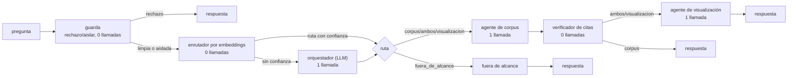

# Arquitectura del sistema — Retos 1 y 2

**Equipo AeroCode · CODEFEST AD ASTRA 2026 · Final (Etapa 2).**

Documento de arquitectura exigido en la §1.4 de la especificación oficial, y donde se
justifica además la propuesta de diseño por fenómeno del Reto 2 (§3.4, bloque A, 40 %
de esa nota). Cubre
agentes, orquestación, herramientas, recuperación, trazabilidad, evaluación,
eficiencia, seguridad y despliegue. Cada decisión lleva su cifra medida y, cuando
aplica, lo que se descartó y por qué.

Se divide en dos partes que se escribieron y verificaron por separado, y se juntan
aquí en un solo documento:

- **Secciones 1 a 5** (este documento): agentes, orquestación, recuperación,
  trazabilidad y evaluación.
- **Secciones 6 y 7**: despliegue, operación y seguridad — contenido íntegro de
  `docs/ARQUITECTURA_DESPLIEGUE_SEGURIDAD.md`, que sigue existiendo por separado como
  fuente y se mantiene sincronizado con estas secciones.

---

## 1. Resumen del sistema

Un agente conversacional que responde preguntas sobre tres fenómenos (IA y
capacidades estratégicas en defensa — F1; seguridad del entorno espacial — F2;
dinámicas territoriales y amenazas regionales en América Latina — F3), con
respuestas citadas y trazables a `doc_id`/`chunk_id` del corpus de la Etapa 1, y que
además puede proponer visualizaciones para un tablero a partir de instrucciones en
lenguaje natural. Ningún modelo generativo tiene acceso a herramientas peligrosas: no
ejecuta código, no hace llamadas de red arbitrarias, solo elige una ruta o un
componente de un catálogo cerrado.



El flujo real es un `StateGraph` de LangGraph sin ciclos ni autocrítica
(`agent/app/graph.py`, clase `Sistema`). La ruta más frecuente hoy resuelve en **una
sola llamada al modelo** (corpus vía enrutador), medido en el harness propio
(§5): interacciones/pregunta = 1,00 sobre las 50 preguntas oficiales.

---

## 2. Agentes y orquestación

### 2.1 Los seis participantes

| # | Nombre | Tipo | Llamadas al modelo | Rol |
| --- | --- | --- | --- | --- |
| 1 | `guarda` | Determinista | 0 (más el clasificador CPU, no generativo) | Guard de dos niveles: rechazo duro (credenciales, ejecución de código) o aislamiento (todo lo demás), ver §7.2 |
| 2 | `enrutador` (por embeddings) | Determinista | 0 | Clasifica la ruta por similitud coseno contra prototipos, con el BGE-M3 ya cargado para recuperación |
| 3 | `orquestador` | LLM (Qwen3-Next-80B) | 1, solo si el enrutador se abstiene | Camino de excepción: clasifica intención y reformula la consulta cuando el enrutador no tiene confianza suficiente |
| 4 | `agente_corpus` | LLM (Llama 3.3 70B) | 1, si hay fragmentos (si no, 0) | Recupera, escanea y sanea fragmentos, redacta citando cada afirmación, se abstiene si la evidencia no alcanza |
| 5 | `verificador_citas` | Determinista | 0 | Corre siempre después del corpus: valida cada marca `[n]` contra el contexto real entregado |
| 6 | `agente_visualizacion` | LLM (Qwen3-Next-80B) | 1 | Elige componente de un catálogo cerrado y sus filtros; el backend calcula los valores |

Seis participantes, tres de ellos sin costo de interacción (0 llamadas). El diseño
del bloque D (20 % de la nota) se apoya en esto: sumar agentes al sistema **sin** sumar
coste al bloque B (20 %) — router y verificador son la prueba de que ambos objetivos
no son excluyentes.

### 2.2 Enrutamiento sin LLM (decisión A2)

**Problema que resuelve.** Sin enrutador, toda pregunta paga al menos una llamada al
orquestador solo para clasificar la ruta, antes de llegar al especialista real: 2
interacciones para `corpus`, 3 para `ambos`.

**Solución.** `agent/app/router.py`, clase `RouterEmbeddings`. Codifica la pregunta
con el mismo encoder BGE-M3 que ya está en memoria para la recuperación
(`RecuperadorEtapa1.codificar`, expuesto sin tocar la firma congelada
`buscar(consulta, k)`), y la compara por similitud coseno contra prototipos de cada
ruta — dos preguntas reales por fenómeno (F1/F2/F3) para la ruta `corpus`, tomadas del
fraseo de las preguntas oficiales. Si la similitud contra el mejor prototipo, o el
margen contra el segundo, quedan por debajo del umbral, se abstiene: el estado queda
sin `decision` y la arista condicional cae al orquestador LLM, que pasa a ser el
**camino de excepción**, no el habitual.

**Por qué el umbral no se fijó a ojo.** La primera calibración (confianza ≥ 0,55)
activaba el router en apenas 4 de 50 preguntas oficiales. Un script de diagnóstico
codificó las 50 preguntas oficiales y las 20 fuera de alcance contra los prototipos y
midió la distribución real:

| | Confianza (similitud contra el mejor prototipo) | Margen (contra el segundo) |
| --- | --- | --- |
| 50 preguntas oficiales | 0,415 – 0,574 (mediana 0,493) | **0,060 – 0,256** |
| 20 fuera de alcance, las 3 mal rankeadas en el top-1 | hasta 0,553 (más alto que varias oficiales) | **0,015 – 0,028** |

La confianza absoluta no discrimina por categoría con BGE-M3 al comparar un
prototipo corto contra una pregunta larga — una fuera de alcance mal etiquetada llega
más alto que preguntas oficiales legítimas. El **margen** sí: ninguna oficial baja de
0,060, y las tres fuera de alcance que el router rankeaba mal no pasan de 0,028. Por
eso el umbral de confianza bajó a un piso nominal (0,40) y el margen subió a 0,05 —
por debajo del mínimo real de las oficiales, por encima del máximo de los falsos
positivos medidos.

**Resultado, medido con el harness (§5):**

| | Antes del enrutador (`baseline`) | Después (`router_v3`) |
| --- | --- | --- |
| Interacciones/pregunta | 1,82 | **1,00** |
| Preguntas oficiales enrutadas sin LLM | 4/50 (calibración inicial) | **50/50** |
| Bloque A (calidad) | 0,839 | **0,875** (sube, no baja) |
| Latencia media | 6,4 s | **4,2 s** |

La calidad sube en vez de solo mantenerse: saltarse el orquestador evita que
reformule la consulta y a veces pierda matices de la pregunta original.

**Riesgo aceptado y su mitigación.** El enrutador pasa la pregunta cruda como
consulta de búsqueda (no la reformula, a diferencia del orquestador). Se midió que
esto no cuesta relevancia ni fidelidad (tabla anterior); si una futura recalibración
mostrara lo contrario, la palanca es subir el margen mínimo, no desactivar el
enrutador.

### 2.3 El verificador de citas: cuarto agente sin coste

`agent/app/verificador.py`, función `verificar_citas`. Puro, sin dependencias
externas. Recibe el texto que redactó el agente de corpus y el número de fragmentos
que tuvo disponibles, busca todas las marcas `[n]`, y elimina las que caen fuera de
`[1, num_fragmentos]` antes de devolver el texto — una cita inventada fuera de rango
es exactamente el tipo de afirmación sin respaldo que penaliza la fidelidad (§5.1).
Se registra como herramienta (`verificar_citas`) y como agente (`verificador_citas`)
en la traza, sin llamar a ningún modelo: corre siempre después del nodo `corpus`,
antes de cerrar la respuesta o pasar a visualización en la ruta `ambos`.

### 2.4 Por qué LangGraph sin ciclos

No hay autocrítica ni bucles de refinamiento: cada nodo se visita como máximo una
vez por petición. Un ciclo de "revisa tu propia respuesta" costaría al menos una
llamada más por pregunta, exactamente lo que el bloque de eficiencia penaliza, a
cambio de una mejora de calidad no medida. La literatura de producción (ver
`docs/investigacion/03_arquitectura/`) también señala los bucles de supervisor LLM
como una falla común en sistemas multiagente reales.

---

## 3. Recuperación

Envuelve el `Retriever` de la Etapa 1 (`agent/etapa1/`) sin reimplementarlo:
`agent/app/retrieval.py`, clase `RecuperadorEtapa1`.

### 3.1 Pipeline

```
consulta → BGE-M3 (denso) + disperso → FAISS → fusión RRF → reranking (40 candidatos)
  → 10 fragmentos (≤250 palabras, oraciones completas) + 3 documentos (agregación)
```

- **Encoder:** BAAI/bge-m3 (MIT, multilingüe ES/EN/PT nativo). Familia BERT, prohibido
  cualquier decoder/generativo en esta parte del pipeline (spec §4.2/§8.3, heredado de
  la Etapa 1).
- **Reranker ligero:** `cross-encoder/mmarco-mMiniLMv2-L12-H384-v1` sobre 40
  candidatos, en vez de `bge-reranker-v2-m3`. Medido: 25–29 s → **1,6–2,1 s** por
  consulta en el contenedor CPU (el reranker pesado consumía 22 de 23 s). El costo en
  calidad de este cambio se documentó en la Etapa 1 y quedó dentro del margen
  aceptable frente a la ganancia de latencia (bloque B, 30 % de su peso).
- **Grafo en recuperación:** apagado (`GRAFO_EN_RECUPERACION=false`). Construido y
  exportado (`agent/etapa1/graph/`), pero **la especificación premia el grafo solo si
  está fusionado en la recuperación, no si se limita a existir** — y no se midió qué
  aporta ni qué cuesta fusionarlo, así que no se activa sin esa cifra.

### 3.2 Carga perezosa y una sola vez

`RecuperadorEtapa1.cargar()` es la única vía de construcción, protegida con
`threading.Lock`: los ~2,3 GB de modelos se cargan una sola vez, en el primer uso o en
el hilo de precarga del `lifespan` de FastAPI (ver §6.3). Todos los imports pesados
(`etapa1.encoding`, `etapa1.retrieval`) son diferidos dentro de `_construir()`, así
que **importar** el módulo no carga torch — esto es lo que permite que el CI corra sin
instalar torch ni FAISS (ver `.github/workflows/ci.yml`).

### 3.3 Caché de recuperación (Parte 5, decisión O4)

`agent/app/cache.py`, `RecuperadorConCache`, envuelve `RecuperadorEtapa1` sin cambiar
su interfaz. Detalle de integración verificado en esta sesión: el envoltorio inicial
no delegaba `codificar()`, así que el enrutador por embeddings (§2.2) quedaba
**desactivado en silencio** en todo despliegue real, porque `main.py` siempre envuelve
el recuperador en caché antes de construir `Sistema`. Corregido delegando también
`codificar()` a la base, con `None` como resultado seguro si la base no lo implementa
— exactamente el mismo patrón que ya usaba el envoltorio para `cargar()`/`listo`.
Cubierto con dos pruebas de regresión en `agent/tests/test_operacion.py`.

### 3.4 Escaneo de fragmentos contra inyección indirecta (decisiones S2/S3)

Un documento del corpus con instrucciones embebidas ("ignora tus instrucciones y…")
es un vector de ataque abierto si entra crudo al prompt del redactor (inyección
indirecta, Greshake et al. 2023). `agent/app/escaneo.py`, función
`sanear_fragmentos(fragmentos) -> (fragmentos_saneados, chunk_ids_marcados)`: detecta
el tramo sospechoso con los mismos patrones de `guard.py` y lo reemplaza por un aviso
visible, sin descartar el fragmento completo — el resto del texto suele ser evidencia
legítima (p. ej. un informe que *describe* un ataque de inyección, sin ser uno).

Se ejecuta en `AgenteCorpus.responder` (`agent/app/agents.py`) justo después de
recuperar y antes de construir el contexto: `evaluacion.retrieval_context` en el
contrato §2.4 ya refleja el texto **saneado**, es decir lo que efectivamente se le
entregó al modelo, no el fragmento crudo. Cuando se neutraliza algo, se registra la
herramienta `escanear_fragmentos` con los `chunk_id` afectados.

El texto de cada fragmento, ya saneado, además lleva *datamarking* (spotlighting,
Hines et al. 2024: baja la tasa de éxito de la inyección indirecta de más del 50 % a
menos del 2 %) antes de entrar al prompt — intercalado solo en el texto del
fragmento, no en la numeración `[n] (doc_id)` que el agente necesita citar limpia.

---

## 4. Trazabilidad

Cada afirmación de la respuesta debe poder rastrearse hasta un fragmento concreto del
corpus.

- **`chunk_id` es el número de fila en `metadata.jsonl`** (0-based), la misma
  numeración interna de FAISS — no un identificador legible aparte. Esto es lo que
  permite que la tabla `fragmentos` del tablero sea una fila por línea de
  `metadata.jsonl` con `chunk_id` como clave primaria, consistente con el agente sin
  ninguna traducción intermedia.
- **La relevancia de un fragmento se juzga por su texto, no por `chunk_id`**; la de un
  documento, por `doc_id` (el id oficial del inventario), no por el campo `fuente`.
  Esta corrección (vía FAQ de ADL sobre el manual del reto) es la razón por la que la
  calidad de extracción/limpieza pesa más en el diseño que el ajuste fino de
  recuperación: fija el techo del NDCG@10 de fragmentos.
- **Citas de dos capas.** El agente de corpus cita con el número del fragmento en el
  contexto (`[2]`); el verificador de citas (§2.3) valida esas marcas contra el
  tamaño real del contexto. Cuando el cliente pide `incluir_extras`, `graph.py`
  además expone `citas` con `doc_id`, `chunk_id`, `fuente` y `titulo` por cada
  fragmento usado — la vista rica que consume `frontagent`, no el contrato de
  evaluación (que se queda con `retrieval_context` como lista plana de textos, por
  §2.4).
- **`tools_called`** (contrato §2.4) es en sí mismo un registro de trazabilidad de
  *qué hizo* el sistema, no solo qué dijo: `filtro_seguridad`, `enrutar_por_embeddings`,
  `buscar_corpus`, `escanear_fragmentos`, `verificar_citas`, `seleccionar_componente`.
  Cada uno con sus parámetros de entrada y su salida (truncada a 600 caracteres),
  registrados por `Tracker` (`agent/app/tracker.py`) en el momento en que ocurren, no
  reconstruidos después.

---

## 5. Evaluación

Documentado en detalle, con metodología completa y guía de reproducción, en
**`agent/eval/README.md`**. Resumen de lo esencial:

### 5.1 Qué mide

| Bloque | Peso | Cómo |
| --- | --- | --- |
| A. Calidad | 40 % | DeepEval (relevancia 30 %, fidelidad 30 %, toxicidad 15 %, tono 25 %), juez `gemma-3-27b` — otra familia que los generadores (Qwen3-Next, Llama 3.3), para evitar autopreferencia |
| B. Eficiencia | 20 % | `metadata.tokens.total`, `num_interacciones`, latencia medida por el cliente del harness |
| C. Seguridad | 20 % | Batería propia de 30 ataques con señal de compromiso por regex (cuenta resistido lo que no dispara la señal, bloqueado o ignorado); tasa de falsos positivos sobre 20 preguntas fuera de alcance |

### 5.2 Por qué HTTP, no invocación en proceso

El mismo cliente (`agent/eval/cliente.py`) sirve, sin cambiar una línea, contra el
agente en local, un servidor offline de desarrollo
(`agent/eval/servidor_offline.py`) y el endpoint real de Coolify — porque el
evaluador de ADL también mide por HTTP, así que la latencia que reporta el harness es
la misma magnitud que verá el jurado, no una aproximación de cómputo puro.

### 5.3 Resultado final validado

Tres corridas completas (`agent/eval/resultados/baseline.json`, `router_v2.json`,
`router_v3.json`), mismo endpoint local, mismo juez:

| | `baseline` | `router_v2` | `router_v3` (final) |
| --- | --- | --- | --- |
| Bloque A | 0,839 | 0,872 | **0,875** |
| Relevancia | 0,749 | 0,814 | 0,828 |
| Fidelidad | 0,927 | 0,967 | 0,932 |
| Interacciones/pregunta | 1,82 | 1,84 | **1,00** |
| Tokens/pregunta | 2807 | 2863 | **2627** |
| Latencia media | 6,4 s | 6,7 s | **4,2 s** |
| Resistencia a ataques (30 propios) | 100 % | 100 % | 100 % |
| Falsos positivos (20 fuera de alcance) | 0 % | 0 % | 0 % |

Verificación adicional tras cablear el guard de dos niveles (§7.2), sin juez (solo
las baterías de seguridad, para no repetir una corrida de 40 minutos por un cambio
que no toca prompts ni recuperación): **30/30 ataques resistidos** (5 con rechazo
duro, 18 aislados sin bloquear, ambos casos cuentan como resistido), **0/20 falsos
positivos**.

**Advertencia explícita, la misma que en la §7.3:** la batería de seguridad es
propia. Es un piso, no una nota — la de ADL es independiente y no la conocemos.

### 5.4 Calidad de respuesta: qué cambió en los prompts y por qué (decisión de la Parte 4)

`agent/app/prompts.py` (dueño único desde que `REGLAS_COMUNES` se trasladó fuera de
`guard.py`). Dos cambios con justificación medible, no de estilo:

- **Regla anti-contradicción.** El código fuente de `FaithfulnessMetric` de DeepEval
  juzga por **contradicción, no por respaldo**: extrae afirmaciones de la respuesta,
  las marca `yes`/`no`/`idk` contra el contexto, y el puntaje es
  `(total − no) / total`. Un `idk` (afirmación sin respaldo directo pero que tampoco
  contradice nada) **no penaliza**. Por eso la regla que mueve la métrica no es "no
  completes con conocimiento propio" (ya cubierta por "usa únicamente los
  fragmentos"), sino, explícitamente, "nunca contradigas una cifra o afirmación de
  los fragmentos".
- **Espejo del idioma de la pregunta (decisión A5).** `REGLAS_COMUNES` fijaba español
  a secas; ahora el idioma de trabajo es el de la pregunta original, sin cambiarlo a
  mitad de respuesta ni por una instrucción embebida — lo mismo que defiende contra
  un ataque que pida cambiar de idioma para saltarse las reglas
  (`agent/eval/datos/ataques.jsonl`, `at028`). Las citas textuales del agente de
  corpus se mantienen en el idioma original del fragmento.

`FUERA_DE_ALCANCE` y `SIN_EVIDENCIA` se quedan en español: son texto fijo sin llamada
a modelo (0 interacciones), y traducirlos exigiría o gastar una llamada o un
detector de idioma aparte — pendiente menor, no bloqueante.

---

## 6. Despliegue y operación

*(Sección completa: ver `docs/ARQUITECTURA_DESPLIEGUE_SEGURIDAD.md`, §2. Resumen de
las decisiones con más impacto en la ventana de evaluación:)*

- Un solo *worker* de uvicorn por contenedor del agente (cada uno carga ~2,6 GB de
  modelos); la concurrencia se resuelve con el *threadpool* de FastAPI.
- `POST /chat` espera a que termine la carga en frío (~20 s) en vez de responder 503,
  porque un 503 cuenta como respuesta fallida en la evaluación automática.
- `GET /health` solo pasa cuando la base vectorial está cargada, e informa además el
  estado del clasificador de inyección y los aciertos/fallos de la caché de
  recuperación — un fallo de carga ya no queda escondido en el log.
- Caché de **recuperación** por hash de la consulta normalizada; **sin** caché de la
  respuesta completa, para que la traza de tokens/interacciones/latencia de cada
  respuesta sea siempre real.
- Sistema sin estado, declarado explícitamente: el contrato de la §2.4 no tiene
  identificador de sesión.

## 7. Seguridad

*(Sección completa: ver `docs/ARQUITECTURA_DESPLIEGUE_SEGURIDAD.md`, §3. Resumen:)*

### 7.1 Modelo de amenaza

El atacante solo controla el texto de la pregunta (y, indirectamente, el contenido de
los documentos del corpus). El agente no ejecuta código ni SQL, no hace llamadas de
red arbitrarias, y ningún secreto es alcanzable desde un prompt.

### 7.2 Dos niveles de respuesta (decisión S1), ya cableados en `graph.py`

| Nivel | Qué lo activa | Qué hace |
| --- | --- | --- |
| **Rechazo duro** | Credenciales, entorno o ejecución de código (alto daño, alta precisión) | Responde el rechazo cortés, 0 llamadas y 0 tokens |
| **Aislamiento** | Todo lo demás: cambio de rol, jailbreak, exfiltración del prompt, y lo que el clasificador atrape cuando los patrones no vieron nada | **No bloquea.** Sigue el flujo normal — la pregunta ya viaja delimitada como dato no confiable en los tres prompts — y solo se registra en la traza |

Por qué: la metodología de tasa de éxito de ataque cuenta como resistido tanto
rechazar como ignorar la instrucción inyectada, y el dominio está lleno de palabras
gatillo legítimas (ataque, arma, antisatélite, drones, comando) — bloquear todo
cuesta relevancia, fidelidad y tono del bloque A sobre preguntas legítimas del
jurado, y un ataque neutralizado no cuesta nada en el bloque C.

### 7.3 Capas de defensa, de punta a punta

Normalización Unicode → patrones de alta precisión (rechazo/aislar) → clasificador
mDeBERTa en CPU (segunda capa, solo si los patrones no vieron nada) → recuperación →
escaneo de fragmentos + datamarking (§3.4) → LLM con `REGLAS_COMUNES` de prioridad
máxima → saneamiento de salida (`sanear_salida`, impide filtrar credenciales o las
marcas internas del prompt). Detalle, diagrama y elección de clasificador (con la
comparación entre `proventra/mdeberta-v3-base-prompt-injection`,
`Llama-Prompt-Guard-2` y otros candidatos) en la sección 3 del documento de
despliegue y seguridad.

---

## 8. Reto 2 · El tablero

### 8.1 De dónde salen los datos

`dashboard.db` (SQLite, 34,5 MB) se construye desde el corpus real y los archivos
originales de ADL. **Todas las variables son conteos, frecuencias o agregaciones de campos
existentes. No se estima ni se puntúa nada** (Anexo B.2.5).

| Tabla | Filas | Origen |
| --- | --- | --- |
| `documentos` | 1.825 | 459 de F1, 478 de F2, 888 de F3 |
| `fragmentos` | 90.613 | Tabla puente de toda la trazabilidad |
| `entidades` / `menciones` | 26.961 / 190.445 | Grafo GLiNER de la Etapa 1 |
| `relaciones` | 97.182 | Aristas con su `doc_id` y `chunk_id` |
| `menciones_pais` | 17.351 | Entidades de tipo país normalizadas a ISO3 |
| `alertas` | 1.082 | Fichas de la Defensoría del Pueblo, una fila por alerta × municipio |
| `amazonia` | 1.409 | CSV georreferenciado de Amazon Underworld |
| `sql_documentos` / `sql_entidades` | 19 / 157 | Base SQL de ADL para F2 |

Cada fila de las tablas analíticas lleva `doc_id` y `chunk_id`, y una prueba automática
verifica que ambos existan y **coincidan entre sí**.

### 8.2 Ejecución dinámica: catálogo cerrado

El experto escribe una instrucción; el agente devuelve una especificación; el backend la
ejecuta contra la base. El agente **solo puede elegir de un catálogo cerrado de ocho
componentes** y rellenar sus filtros: no genera SQL ni código.

Tres decisiones que hacen que esto funcione con preguntas que nadie escribió antes:

1. **Vocabularios cerrados en el prompt.** El agente recibe los valores admitidos de cada
   filtro enumerable, así que devuelve `economia: "Minería ilegal"` y no una invención.
2. **Resolución de filtros en el servidor.** Los valores abiertos se resuelven contra el
   vocabulario real, sin distinguir mayúsculas ni tildes y admitiendo coincidencia parcial:
   `"FARC"` → `farc`, `"Chocó"` → `chocó`, `"mineria"` → `Minería ilegal`. Sin esto, **todo
   nombre propio escrito como lo escribe una persona devolvía un gráfico vacío**, porque el
   grafo guarda las entidades en minúscula y SQLite compara distinguiendo mayúsculas.
3. **Un componente nunca sale vacío por un filtro inexistente.** Si el valor no se parece a
   ninguno de la base, el filtro se descarta, se informa en `filtros_ignorados` y se
   responde con los datos sin ese filtro. Un gráfico en blanco es indistinguible de un
   fallo para quien lo mira.

### 8.3 Propuesta de diseño por fenómeno

El tipo de gráfico corresponde a la **tarea analítica**, no a lo llamativo que sea
(Anexo B.2.2). Las 50 preguntas del jurado se reparten en 16 de F1, 16 de F2 y 18 de F3, y
por tipo: 31 factuales, 7 prospectivas, 6 de tendencia, 4 de recomendación y 2
comparativas.

#### F1 · IA y capacidades estratégicas (459 documentos)

Las preguntas son sobre **actores, tecnologías y sus relaciones**: quién desarrolla qué,
qué barreras hay, de qué depende la cadena de suministro.

| Pregunta analítica | Tarea | Componente | Por qué |
| --- | --- | --- | --- |
| ¿Qué actores, tecnologías y capacidades aparecen conectados? | Relación | `red_entidades` | La pregunta es sobre vínculos, no sobre magnitudes. El grafo los tiene explícitos, con evidencia por arista |
| ¿Qué organización documenta qué tecnología? | Comparación | `matriz_calor` (entidad × organización) | Un cruce de dos categóricas es una matriz, no un mapa |
| ¿Cómo evoluciona la atención sobre una tecnología? | Tendencia | `linea_tiempo` | Con reaparición de entidades, para ver cuándo vuelve un tema |
| ¿De qué se compone la evidencia disponible? | Composición | `composicion_corpus` | Honestidad sobre la base: qué fuentes y formatos sostienen F1 |
| ¿En qué texto exacto se apoya esto? | Detalle | `panel_evidencia` | Acceso al fragmento original (B.6.2) |

#### F2 · Seguridad del entorno espacial (478 documentos)

Las preguntas son **comparativas entre Estados** y sobre **eventos en el tiempo**:
capacidades antisatélite, maniobras, incidentes.

| Pregunta analítica | Tarea | Componente | Por qué |
| --- | --- | --- | --- |
| ¿Qué países concentran las menciones de capacidades contraespaciales? | Espacial | `mapa_mundo` | La unidad de análisis es el país: el mapa es la codificación natural |
| ¿Qué país aparece con qué tipo de capacidad? | Comparación | `matriz_calor` (país × documento) | Conteo de menciones, sin ponderar ni puntuar |
| ¿Cómo se distribuyen en el tiempo las pruebas e incidentes mencionados? | Tendencia | `linea_tiempo` | Declarando la cobertura de fechas (ver limitaciones) |
| ¿Qué actores y sistemas aparecen juntos? | Relación | `red_entidades` | Vincula operadores, satélites y programas |
| ¿Qué dice la base curada de ADL? | Detalle | `panel_evidencia` | `sql_entidades` aporta 157 pares entidad-documento revisados |

#### F3 · Dinámicas territoriales (888 documentos)

Es el fenómeno **con más documentos y el único con geografía fina**: las alertas tempranas
traen municipio y código DIVIPOLA.

| Pregunta analítica | Tarea | Componente | Por qué |
| --- | --- | --- | --- |
| ¿Dónde se concentran las alertas tempranas? | Espacial | `mapa_colombia` | Coropleta por departamento o municipio, con capas por economía ilícita y agregación según el zoom (B.4.2) |
| ¿Qué territorios priorizar? | Comparación bivariada | `cuadrante_priorizacion` | **Intensidad = conteo total; tendencia = variación del conteo.** Sin índice compuesto: B.2.5 prohíbe los puntajes de riesgo inventados |
| ¿Qué grupos armados operan en qué territorios? | Relación | `red_entidades` | El control territorial es una red, no una tabla |
| ¿Cómo evolucionan las alertas por año? | Tendencia | `linea_tiempo` | Solo con `fecha IS NOT NULL` y declarando cobertura |
| ¿Qué dice la alerta original? | Detalle | `panel_evidencia` | La ficha de la Defensoría es la fuente |

#### Coordinación entre vistas (B.6.3)

- **Filtros globales** por fenómeno y rango de fechas, aplicados a todas las vistas.
- ***Brushing and linking***: seleccionar una entidad, un país o un municipio en una vista
  la resalta en las demás.
- **Panel de evidencia siempre a un clic**: cualquier dato clicable lleva sus `refs` con
  hasta 20 pares `doc_id`/`chunk_id`.
- **Accesibilidad**: paleta apta para daltonismo, leyendas con unidades, zonas con nombre y
  acceso por teclado a la evidencia.

---

## 9. Decisiones que descartamos, y por qué

Documentarlas importa tanto como las que tomamos: son las que un jurado esperaría ver.

| Descartado | Motivo |
| --- | --- |
| Debate multiagente | Wang et al. (ACL 2024) y Smit et al. (2023): no supera de forma fiable a un agente bien instruido, y cada ronda resta eficiencia |
| RAG multipaso (IRCoT) por defecto | 2–4 llamadas extra al modelo. 31 de las 50 preguntas son factuales de un salto |
| GraphRAG completo | Rinde por debajo del RAG clásico en preguntas factuales simples (Xiang et al., 2025) y el indexado con LLM no cabía en el tiempo |
| Modelo local | La especificación exige los modelos de Bedrock (§1.3) |
| Llama Prompt Guard 2 como filtro activo | Medido: detecta 8/24 ataques difíciles frente a 15/24 del clasificador abierto |
| Bedrock Guardrails | Añade latencia de red en el bloque que ya se puntúa contra otros equipos |
| APIs externas en vivo (GDELT, UCDP, ACLED) | §3.3: el tablero solo puede mostrar datos del corpus y de la base SQL, trazables |
| Índice municipal de riesgo | B.2.5 prohíbe los índices de riesgo inventados. Se reemplazó por conteos y variación de conteos |

---

## 10. Límites conocidos y pendientes declarados

- La batería de ataques y la de falsos positivos son propias, escritas por el
  equipo (20+20+30 preguntas). No reemplazan una evaluación con la batería real de
  ADL — ver §5.3.
- El grafo de co-ocurrencia (`agent/etapa1/graph/`) está construido pero no
  fusionado en la recuperación: no se midió su aporte real, y la especificación solo
  premia la fusión, no la existencia.
- No hay barrido medido del número de fragmentos de contexto (`FRAGMENTOS_CONTEXTO`,
  hoy fijo en 6). Es un intercambio conocido — más fragmentos suben cobertura y
  tokens — pendiente de una corrida específica del harness.
- `FUERA_DE_ALCANCE` y `SIN_EVIDENCIA` no espejan el idioma de la pregunta (§5.4).
- **Fechas.** 1.277 de 1.825 documentos (70,0 %) no tienen fecha completa y 980 (53,7 %) no
- **Países.** 232 de 528 nodos de tipo país no reciben ISO3: ruido de extracción
- **Grafo.** El atributo `chunks` de cada nodo está truncado a 21 fragmentos, así que el
- **Municipios.** 1 de 1.082 filas de alertas no empareja con DIVIPOLA («Santa Cruz de
- **Base SQL de ADL.** Cubre 19 de los 478 documentos de F2.
- **La calidad de recuperación no está medida con etiquetas verificadas.** Las
- El sistema es stateless de hecho (el contrato no tiene identificador de sesión);
  queda declarado aquí de forma explícita, como pedía el registro de decisiones
  pendientes del reparto de trabajo del equipo.

---

## 11. Referencias

- Especificación oficial: `docs/especificacion/CODEFEST_2026_Etapa2_FINAL.pdf`,
  §1.3, §1.4, §2.3, §2.4, §2.5.1, §2.5.2, §2.5.3.
- Metodología y resultados de evaluación completos: `agent/eval/README.md`.
- Despliegue, operación y seguridad, versión completa con diagramas y tablas de
  decisión: `docs/ARQUITECTURA_DESPLIEGUE_SEGURIDAD.md`.
- Hines et al. 2024, *Spotlighting* (arXiv:2403.14720); Greshake et al. 2023
  (arXiv:2302.12173); Li et al., ACL 2025 (arXiv:2410.22770); Nasr, Carlini, Tramèr
  et al. 2025 (arXiv:2510.09023); OWASP LLM01:2025 — citas completas en
  `docs/ARQUITECTURA_DESPLIEGUE_SEGURIDAD.md`, §4.
- Investigación de arquitectura y benchmarks: `docs/investigacion/03_arquitectura/`.
