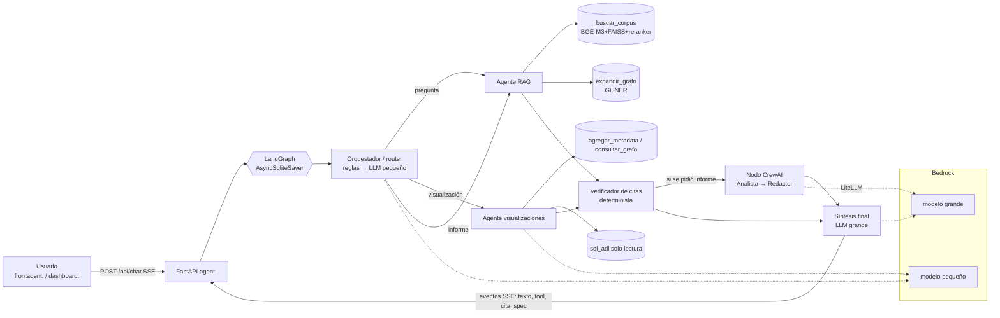

# worldmonitor como base, fuentes de datos vivos y diseño LangGraph + CrewAI

> Fecha: 18-sep-2026. Material de respaldo: clon superficial de `koala73/worldmonitor` (commit `1ec0af6`, 18-sep-2026), log de `npm install` y `vite`, captura de la app corriendo y respuestas crudas de las APIs (scratchpad de la sesión de investigación).
> **Actualizado con las reglas oficiales de la Etapa 2**, que cambian bastante las conclusiones del primer borrador:
>
> 1. Los LLM se usan **solo por API de Amazon Bedrock**, con un presupuesto de 100 USD. Los modelos permitidos son gpt-oss-20b, gpt-oss-120b, Llama 3.3 70B, Llama 4 Scout, Mixtral 8x7B, DeepSeek-R1-Distill-Llama-70B, Qwen3-Next-80B-A3B y Gemma 3 27B. **Queda descartado el modelo local y Ollama.**
> 2. El repo de GitHub debe ser **PRIVADO**. ADL y los evaluadores entran como colaboradores. El despliegue se hace en **Coolify** con Dockerfile, un puerto HTTP por contenedor y los subdominios `agent.`, `frontagent.` y `dashboard.`.
> 3. El tablero del Reto 2 trabaja **solo con datos del corpus** (base vectorial, metadata y grafo) y/o con la base SQL de ADL. **Todo dato debe poder rastrearse hasta `doc_id` y `chunk_id`** y no se aceptan puntajes de riesgo inventados. Las APIs externas quedan, como mucho, de **contexto opcional**. No pueden ser la fuente del tablero.
> 4. Hacen falta **al menos 3 agentes**: un orquestador, uno de preguntas sobre el corpus (RAG) y uno que genera visualizaciones. **La eficiencia (tokens, número de llamadas y latencia) se puntúa comparando con los demás equipos.**

---

## 0. Higiene previa (hecha)

- **No quedó ningún proceso del arranque de worldmonitor.** El servidor de Vite escuchaba en el puerto 3011 y ese puerto ya no está en `netstat -ano | findstr LISTENING`. Tampoco hay procesos `node`/`vite`/`esbuild` cuya línea de comandos incluya `worldmonitor`. Los `node.exe` que siguen vivos son servidores MCP y el delegado de Kiro, que no tienen relación con esto. No hubo que matar nada, salvo un `du` propio que se había colgado.

---

## 1. worldmonitor como base

### 1.1 Ficha

| Aspecto         | Dato verificado                                                                                                                                                                                                                                                                                                                                                    | Fuente                                                    |
| --------------- | ------------------------------------------------------------------------------------------------------------------------------------------------------------------------------------------------------------------------------------------------------------------------------------------------------------------------------------------------------------------ | --------------------------------------------------------- |
| Licencia        | **AGPL-3.0-only** (`"license": "AGPL-3.0-only"` en package.json, `LICENSE` = GNU AGPL v3). El README aclara: "Private-source proprietary use or **official branding rights**: separate commercial or trademark permission needed". Copyright (C) 2024-2026 Elie Habib                                                                                              | https://github.com/koala73/worldmonitor/blob/main/LICENSE |
| Versión         | 2.10.0 (release `v2.10.0` del 08-sep-2026)                                                                                                                                                                                                                                                                                                                         | `gh api repos/koala73/worldmonitor/releases/latest`       |
| Popularidad     | 86.937 estrellas, 13.185 forks, 399 issues abiertos                                                                                                                                                                                                                                                                                                                | `gh api repos/koala73/worldmonitor` (18-sep-2026)         |
| Mantenimiento   | Repo creado el 08-ene-2026, último push el 18-sep-2026. **Unos 1.729 commits desde el 18-ago-2026** (paginación de `commits?since=2026-08-18&per_page=1`). Cambia muchísimo, así que el fork va a divergir enseguida y conviene **fijarlo a un commit**                                                                                                            | gh api                                                    |
| Tamaño          | 7.124 archivos versionados. `npm install` agregó **1.654 paquetes** en unos 2 min 34 s                                                                                                                                                                                                                                                                             | `git ls-files`, npm_install.log                           |
| Stack frontend  | TypeScript sin framework (vanilla, con algo de Preact), Vite 6, **deck.gl 9 + MapLibre GL** (mapa plano), globe.gl + Three.js (globo), d3, supercluster, h3-js, pmtiles, i18next (con `es.json`), Transformers.js/ONNX en Web Workers                                                                                                                              | README, package.json, ARCHITECTURE.md                     |
| Backend         | Vercel Edge Functions (`api/`, 35 dominios en `server/worldmonitor/*`: conflict, cyber, displacement, military, maritime, etc.) con contratos en Protocol Buffers ("sebuf"), relay y seeds en Railway, **Upstash Redis**, **Convex** (billing, usuarios, memoria vectorial), Clerk (auth), Dodo (pagos), Sentry, escritorio Tauri 2                                | ARCHITECTURE.md §2–4                                      |
| Estructura      | `src/` (App.ts de 194 KB, `components/` con 207 archivos, 123 de ellos `*Panel*`, `config/`, `services/`, `workers/`, `locales/`), `api/`, `server/`, `proto/`, `scripts/` (seeds), `docker/` (nginx + SPA), `src-tauri/`, `convex/`, `sdk/` (Python/Ruby/Go), `cli/`, `blog-site/`, `consumer-prices-core/`                                                       | árbol del clon                                            |
| Cómo se ejecuta | `npm install && npm run dev` (Vite; `DEV_PORT` en `.env.local`). Variantes: `dev:tech`, `dev:finance`, etc. Para producción, `docker/Dockerfile` usa `node:24-alpine`, compila la SPA y la sirve con nginx                                                                                                                                                         | README "Quick Start", docker/Dockerfile                   |
| API keys        | Según el README, "The app runs with no environment variables", pero `.env.example` (49,6 KB) lista más de 100 variables: `ACLED_EMAIL/PASSWORD/ACCESS_TOKEN`, `UCDP_ACCESS_TOKEN`, `RELIEFWEB_APPNAME`, `NASA_FIRMS_API_KEY`, `UPSTASH_REDIS_*`, `CONVEX_*`, `CLERK_*`, `GROQ/OPENROUTER/ANTHROPIC_API_KEY`, `LLM_API_URL/LLM_MODEL`, `OLLAMA_API_URL/MODEL`, etc. | .env.example                                              |
| Capas del mapa  | `src/config/map-layer-definitions.ts` define unas 58 capas: conflicts, hotspots, ucdpEvents, protests, displacement, military, bases, nuclear, spaceports, **satellites**, cables, pipelines, datacenters, cyberThreats, gpsJamming, outages, sanctions, ciiChoropleth, fires, natural, climate, minerals, ais, flights, etc.                                      | archivo de capas                                          |
| IA              | `server/_shared/llm.ts` con varios proveedores (Ollama con lista blanca de hosts, Groq, OpenRouter, Anthropic). Clustering y embeddings MiniLM en el navegador. `ChatAnalystPanel.ts` (732 líneas) habla con `/api/chat-analyst` por **SSE con líneas `data: {"delta": ...}`**                                                                                     | código                                                    |
| REST / MCP      | REST `https://api.worldmonitor.app` con OpenAPI (https://worldmonitor.app/openapi.yaml). Servidor MCP Streamable HTTP en `https://worldmonitor.app/mcp` (`tools/call` necesita `X-WorldMonitor-Key` u OAuth). CLI `npx worldmonitor`, SDK `pip install worldmonitor-sdk`                                                                                           | README "Programmatic Access"                              |

### 1.2 Resultado del arranque local

- `npm install`: bien, 1.654 paquetes.
- `vite`: **"VITE v6.4.3 ready in 4233 ms"** en `http://localhost:3011/`.
- Errores y avisos en `vite.log`:
  - `Failed to resolve import "./_inventory-facts.generated.js" from "api/product-catalog.js"`. Faltaban artefactos generados (`npm run product:facts` / `inventory:facts`); ahora el archivo sí aparece en `api/`.
  - Resumen de feeds: `feeds=245… deadline_aborted=true`. De 245–250 feeds, 34 (en) y 93 (es) quedaron completos, y el resto fue `not-started` o `aborted-by-deadline`. Muchos terminaron en `source=both-failed relay_shape=no-relay` porque en local no hay relay de Railway.
  - `story adoption chunk incomplete; expected 270 Redis result(s), got 0`: **no hay Redis**.
  - `503: DDoS summary cache unavailable` / `Traffic anomalies cache unavailable`.
  - `[CII] ACLED returned 0 events … set ACLED_EMAIL/ACLED_PASSWORD (or ACLED_ACCESS_TOKEN)`: **sin credenciales ACLED el índice CII se queda sin la señal de conflicto**.
- **Captura (`wm_shot.png`)**: la interfaz carga **en español**. Se ven la cabecera "MONITOR v2.10.0 · VIVO · Global", el mapa mundial deck.gl con zonas de conflicto sombreadas y marcadores (alto, elevado, monitoreo, conflicto, terremoto) y la botonera de capas (zonas de conflicto, puntos de acceso intel, protestas, bases militares, sanciones, sitios nucleares, actividad militar, cables submarinos, tuberías, centros de datos de IA, GPS jamming, eventos naturales, alertas de clima, vías navegables estratégicas…). A la derecha hay paneles de TV en vivo (Bloomberg, Jerusalem, Middle East) y en primer plano el modal "Mission · Choose Workspace" (Crisis Desk, Supply-Chain Risk, Energy Security, News Seeker, Tech/AI Watcher, Country Watcher…). Arriba aparece un banner PRO de upsell y abajo "Digest coverage: **stale** — 83 publishers, 294 items, feeds 95/250 (older accepted content is being served after a failed rebuild)".
- **Conclusión:** la interfaz arranca en local sin claves, pero **casi todo el contenido "vivo" depende de Redis, relay, credenciales y red externa**. En una demo sin esa infraestructura se ve a medio poblar y marcada como "stale".

### 1.3 Qué cambia con las reglas de la Etapa 2

Con las reglas nuevas se cae **lo que hacía atractivo a worldmonitor: sus más de 50 capas de datos vivos externos**. El tablero debe salir del corpus, con trazabilidad `doc_id`/`chunk_id` y sin puntajes inventados. Eso descarta como fuente del tablero el CII, los "hotspots", el choropleth de riesgo y los feeds. **Lo que sigue sirviendo**:

| Sigue siendo útil                                                                                               | Por qué                                                                                                                                                    |
| --------------------------------------------------------------------------------------------------------------- | ---------------------------------------------------------------------------------------------------------------------------------------------------------- |
| Carcasa de la interfaz: grilla de paneles redimensionables (`Panel.ts`), cabecera, tema oscuro, i18n en español | Da un aspecto de centro de operaciones de nivel empresarial sin diseñarlo desde cero                                                                       |
| `DeckGLMap` (deck.gl + MapLibre): Scatterplot, GeoJson, Heatmap, H3, Arc                                        | Sirve para pintar **entidades geolocalizadas del grafo GLiNER** (municipios o departamentos mencionados en los chunks), con conteos que se pueden rastrear |
| Catálogo de capas con botones y leyenda                                                                         | Se reaprovecha como "capas de fenómeno" F1/F2/F3 alimentadas por el corpus                                                                                 |
| `ChatAnalystPanel` con streaming SSE `data: {delta}`                                                            | Encaja con el "chat integrado" del Reto 2. El backend FastAPI puede emitir el mismo formato                                                                |
| `docker/Dockerfile` (nginx con la SPA)                                                                          | Patrón directo para el contenedor `dashboard.` en Coolify (un puerto HTTP)                                                                                 |

| Ya no sirve (se quita)                                                                                                                              | Motivo                                                                                              |
| --------------------------------------------------------------------------------------------------------------------------------------------------- | --------------------------------------------------------------------------------------------------- |
| `api/` y `server/worldmonitor/*` (Edge de Vercel, protos sebuf), seeds de Railway, Upstash, Convex, Clerk, Dodo, Sentry, Vercel Analytics, Umami    | Infraestructura SaaS ajena a Coolify. Además, los datos externos no pueden ir al tablero            |
| Feeds RSS, TV en vivo, webcams, Telegram, vuelos, AIS, mercados, variantes tech/finance/happy/energy, blog, precios al consumidor, Tauri, SDKs, CLI | Fuera de alcance y generan errores en la demo                                                       |
| CII, hotspots, forecast, resilience score                                                                                                           | Son **puntajes de riesgo propios del upstream, sin rastro a `doc_id`/`chunk_id`**: están prohibidos |
| Marca "World Monitor", logo, banner PRO y enlaces a worldmonitor.app                                                                                | El README exige permiso aparte para la marca oficial                                                |

**Evaluación honesta:** de un repo de 7.124 archivos y 1.654 paquetes nos quedamos con una fracción pequeña (la carcasa, el mapa, el panel de chat y el Dockerfile). Hay dos caminos:

- **A. Fork adelgazado (lo que decidió el equipo).** Se forkea, se fija el commit `1ec0af6` y se borra en masa. Ventaja: aspecto pulido desde el primer día. Coste: desenredar `App.ts` (194 KB) y el bootstrap de 8 fases (`/api/bootstrap`), además de las reglas de lint y boundaries que asumen la infraestructura original.
- **B. App ligera "inspirada en" worldmonitor.** Vite + TypeScript (o React), con deck.gl y MapLibre usados directamente, y copiando **solo** `Panel.ts`, `DeckGLMap` y el lector SSE del chat. Como se copia código AGPL, **el repo sigue siendo AGPL** igual que en A, pero con menos superficie que mantener.

Recomendación: **timebox de 4 horas para A**. Si para entonces la SPA no arranca limpia con el bootstrap desconectado y un panel propio pintando datos del backend, se pasa a B.

### 1.4 Plan concreto de fork (camino A)

1. **Fork privado.** Hacer un fork público de GitHub no sirve, porque el repo debe ser privado. Se crea un repo privado nuevo y se importa el código en `frontend/dashboard/` con historial squash y referencia al commit de origen. Se renombra el producto (por ejemplo, "Centro de Inteligencia FAC") y se quitan logos y banners.
2. **Poda.** Borrar `src-tauri/`, `convex/`, `blog-site/`, `consumer-prices-core/`, `sdk/`, `cli/`, `pro-test/`, `workers/`, casi todo `api/` y `server/`, y `docker/umami`. Eliminar las dependencias `@clerk/*`, `convex`, `@dodopayments/*`, `@upstash/*`, `@vercel/*`, `@sentry/*`, `telegram`, `youtubei.js`, `hls.js`, `@anthropic-ai/sdk` y `@aws-sdk/client-s3`. Cortar el bootstrap para que no llame a `/api/bootstrap`, y desactivar `startSmartPollLoop` y los paneles de feeds.
3. **Backend propio (Python).** Contenedor `agent.` con FastAPI, que expone:
   - `POST /api/chat` (SSE): chat de los Retos 1 y 2, con eventos de texto, llamadas a herramientas, citas y especificaciones de gráficos.
   - `GET /api/corpus/stats?fenomeno=F1|F2|F3`: agregados de la metadata del corpus (conteos por fecha, fuente, subfenómeno, entidad), **cada bucket con su lista de `doc_id`/`chunk_id`**.
   - `GET /api/graph/entities?tipo=LOC|ORG…`: nodos y aristas del grafo GLiNER con sus chunks de origen.
   - `GET /api/evidence/{doc_id}/{chunk_id}`: texto del chunk, que alimenta el panel "ver evidencia" en todo el tablero.
   - `GET /source`: descarga del código fuente (cumplimiento AGPL §13; ver §1.6).
4. **Frontends.** `dashboard.` (fork, nginx) con paneles **F1 IA y capacidades estratégicas**, **F2 seguridad espacial** y **F3 amenazas regionales Colombia/Latam**. Cada panel lleva una serie temporal de menciones, un top de entidades del grafo, un mapa de Colombia con municipios o departamentos extraídos por GLiNER (geocodificados con un diccionario DANE local y offline) y la lista de chunks. Al hacer clic en cualquier punto, barra o nodo se abren las evidencias (`doc_id`/`chunk_id`). `ChatAnalystPanel` se reapunta a `agent./api/chat`. Por su parte, `frontagent.` es la interfaz del asistente del Reto 1, que puede salir del mismo build con otra entrada de Vite o ser una SPA mínima.
5. **Mapa base offline.** Evitar tiles de terceros durante la demo: servir un **GeoJSON de departamentos y municipios** empaquetado, o un `.pmtiles` de Colombia desde el mismo nginx (`VITE_PMTILES_URL` apuntando a una ruta local).
6. **Horas estimadas** (estimación del equipo, sin medir): poda y arranque limpio 4–6 h. Backend FastAPI de agregados y evidencia 4–6 h. Paneles F1/F2/F3 con evidencia 8–12 h. Chat SSE conectado 2–3 h. Dockerfiles y Coolify 2–4 h. **Total aproximado: 20–31 h** para el camino A. El camino B se estima parecido o algo menor.

### 1.5 Riesgos de demo

| Riesgo                                                                                                        | Mitigación                                                                                                               |
| ------------------------------------------------------------------------------------------------------------- | ------------------------------------------------------------------------------------------------------------------------ |
| Restos del upstream que llaman a APIs externas o a Redis y fallan (ya observado: 503, "stale", `both-failed`) | Poda agresiva. En el build de producción, bloquear `fetch` a dominios distintos del backend (CSP `connect-src` en nginx) |
| Rate limits de APIs externas (GDELT: "limit requests to one every 5 seconds")                                 | Por regla, las APIs externas no alimentan el tablero. Si se usan como contexto, solo desde un snapshot cacheado          |
| Tiles del mapa desde CDN                                                                                      | GeoJSON o PMTiles local                                                                                                  |
| Latencia y costo de Bedrock en vivo                                                                           | Caché de respuestas para las preguntas de la demo, router determinista y límites de tokens (ver §4.7)                    |
| Divergencia con un upstream que cambia muy rápido                                                             | Fijar el commit y no hacer merges durante el concurso                                                                    |

### 1.6 AGPL con repo privado

- La AGPL **no obliga a publicar el repo**. Obliga a ofrecer el **código fuente correspondiente** a quien reciba el programa o **interactúe con él por red** (§13). Un repo privado es compatible siempre que cada usuario del despliegue pueda obtener el código.
- Cómo cumplir:
  1. Mantener `LICENSE` (AGPL-3.0) y los avisos de copyright de Elie Habib, y añadir `NOTICE` con el origen (repo y commit) y la declaración de cambios con fecha (§5a).
  2. Licenciar **todo el repo** como AGPL-3.0, incluido el backend Python, para evitar discusiones sobre la frontera de la "obra".
  3. Mostrar un enlace visible "Código fuente (AGPL-3.0)" en `dashboard.` y `frontagent.` que lleve a `GET /source` (tarball del commit desplegado). Así también lo obtiene un usuario que no sea colaborador del repo.
  4. No usar la marca "World Monitor".
- **Riesgo a validar con la organización:** si las bases del concurso ceden la propiedad intelectual a la FAC o a Uniandes, o piden un código cerrado, la AGPL puede chocar con eso. Conviene confirmarlo por escrito antes de invertir en el fork.

---

## 2. Repositorios auxiliares

Datos de `gh api repos/<repo>` y de PyPI, consultados el 18-sep-2026.

| Repo                                                                          | Estrellas / forks / issues | Último push | Licencia (GitHub)                                       | PyPI                                        | Papel bajo las reglas de la Etapa 2                                                                                  |
| ----------------------------------------------------------------------------- | -------------------------- | ----------- | ------------------------------------------------------- | ------------------------------------------- | -------------------------------------------------------------------------------------------------------------------- |
| [linwoodc3/gdeltPyR](https://github.com/linwoodc3/gdeltPyR)                   | 257 / 63 / 18              | 2023-11-30  | GPL-3.0                                                 | `gdelt` 0.1.14 (2023-11-27)                 | **Descartar.** Sin mantenimiento, y GDELT no puede ser fuente del tablero                                            |
| [OCHA-DAP/hdx-python-api](https://github.com/OCHA-DAP/hdx-python-api)         | 95 / 18 / 0                | 2026-09-16  | MIT                                                     | `hdx-python-api` 6.7.0 (2026-09-16)         | **Opcional.** Solo para bajar un snapshot de contexto. No va en la ruta crítica                                      |
| [Hasebul/MapAgent](https://github.com/Hasebul/MapAgent)                       | 17 / 2 / 0                 | 2026-01-09  | **sin licencia**                                        | —                                           | **Inspirarse** en el patrón de un agente que genera mapas. **No copiar código**: sin licencia no se puede reutilizar |
| [geopandas/geopandas](https://github.com/geopandas/geopandas)                 | 5.251 / 1.059 / 422        | 2026-09-16  | BSD-3-Clause                                            | `geopandas` 1.1.4 (2026-06-26)              | **Usar en el backend** para unir entidades LOC del grafo con polígonos DANE y agregar por departamento               |
| [keplergl/kepler.gl](https://github.com/keplergl/kepler.gl)                   | 12.013 / 1.957 / 457       | 2026-09-18  | MIT                                                     | `keplergl` 0.3.7 (2025-02-01)               | **Inspirarse** (UX de capas y filtros temporales). Es pesado y duplicaría deck.gl                                    |
| [visgl/deck.gl](https://github.com/visgl/deck.gl)                             | 14.597 / 2.268 / 543       | 2026-09-18  | MIT                                                     | —                                           | **Usar**: ya viene en worldmonitor (`deck.gl` ^9.2.11)                                                               |
| [python-visualization/folium](https://github.com/python-visualization/folium) | 7.400 / 2.260 / 71         | 2026-09-18  | NOASSERTION (GitHub no la detecta; revisar LICENSE.txt) | `folium` 0.20.0 (2025-06-16)                | **Descartar para el tablero.** Como mucho, mapas estáticos en informes exportados                                    |
| [langchain-ai/langgraph](https://github.com/langchain-ai/langgraph)           | 41.907 / 7.079 / 799       | 2026-09-18  | MIT                                                     | `langgraph` 1.2.11 (2026-08-11)             | **Usar** como orquestador                                                                                            |
| [crewAIInc/crewAI](https://github.com/crewAIInc/crewAI)                       | 58.741 / 8.498 / 367       | 2026-09-19  | MIT                                                     | `crewai` 1.15.22 (2026-09-16), Python <3.14 | **Usar de forma acotada** (un solo nodo, ver §4)                                                                     |

---

## 3. Fuentes de datos vivos probadas

**Nota importante:** con las reglas de la Etapa 2, **ninguna de estas fuentes puede alimentar el tablero**, porque no tienen `doc_id`/`chunk_id` del corpus. Como mucho sirven de **contexto opcional** en el chat, marcado como "fuente externa, no corpus". La única vía para que algo externo llegue al tablero sería **ingresarlo como documentos del corpus**, con su propio `doc_id`/`chunk_id`, y solo si la organización lo autoriza.

Pruebas del 18-sep-2026, un intento cada una, con el script `t.py` (urllib, timeout 40 s) o con `curl -m 15`.

| Fuente                                                                     | ¿Respondió sin clave?      | Resultado observado                                                                                                                                                                                                                                                                                                                          | Formato                                                                     | Límites observados o documentados                                                | Campos de ejemplo                                                                                                                                               | Subfenómeno                                                        | Caché offline                                                                                                |
| -------------------------------------------------------------------------- | -------------------------- | -------------------------------------------------------------------------------------------------------------------------------------------------------------------------------------------------------------------------------------------------------------------------------------------------------------------------------------------- | --------------------------------------------------------------------------- | -------------------------------------------------------------------------------- | --------------------------------------------------------------------------------------------------------------------------------------------------------------- | ------------------------------------------------------------------ | ------------------------------------------------------------------------------------------------------------ |
| **GDELT DOC 2.0** `api.gdeltproject.org/api/v2/doc/doc`                    | **Sí, a medias**           | La primera llamada (artlist, `sourcelang:spanish`, 3 días) devolvió JSON con 3 artículos (semana.com "La guerra de drones que Petro ignoró", lafm.com.co "Gobierno reconstruirá subestación de Policía en Guamalito", lasillavacia.com). La siguiente y el timeline recibieron texto plano: "_Please limit requests to one every 5 seconds_" | JSON (`url, title, seendate, domain, language, sourcecountry, socialimage`) | 1 petición cada 5 s (mensaje del servidor)                                       | ver formato                                                                                                                                                     | Violencia política, terrorismo, desinformación (volumen mediático) | Guardar el JSON por consulta y fecha. Espaciar con ≥ 6 s                                                     |
| **GDELT GEO 2.0** `/api/v2/geo/geo`                                        | **No**                     | HTTP 404 "Not Found"                                                                                                                                                                                                                                                                                                                         | —                                                                           | —                                                                                | —                                                                                                                                                               | —                                                                  | No usar                                                                                                      |
| **UCDP GED** `ucdpapi.pcr.uu.se/api/gedevents/25.1`                        | **No**                     | "API token required. Add header: x-ucdp-access-token"                                                                                                                                                                                                                                                                                        | —                                                                           | Pide token (worldmonitor usa `UCDP_ACCESS_TOKEN`)                                | —                                                                                                                                                               | Violencia política                                                 | Descarga del dataset versionado en https://ucdp.uu.se/downloads/                                             |
| **ACLED** `acleddata.com/api/acled/read`                                   | **No**                     | `{"message":"Access denied"}`                                                                                                                                                                                                                                                                                                                | —                                                                           | Pide cuenta (email y contraseña, o token OAuth)                                  | —                                                                                                                                                               | Violencia política, crimen organizado                              | HDX publica "Colombia - Conflict Events" de ACLED (ver HDX)                                                  |
| **ReliefWeb v2** `api.reliefweb.int/v2/reports`                            | **No**                     | 403 "You are not using an approved appname". La **v1 devuelve 410** ("decommissioned")                                                                                                                                                                                                                                                       | JSON                                                                        | Pide un `appname` aprobado (https://apidoc.reliefweb.int/parameters#appname)     | —                                                                                                                                                               | Migración, riesgo climático                                        | Solicitar el appname y guardar los informes en JSON                                                          |
| **HDX (CKAN)** `data.humdata.org/api/3/action/package_search`              | **Sí**                     | `success: true`, 85 resultados para "colombia violence": `monitor-colombia-violence-monitoring` (OCHA Colombia, 2025-05-23), `colombia-acled-conflict-data` (ACLED, **actualizado el 2026-09-17**), `conflict-related-sexual-violence`                                                                                                       | JSON (CKAN)                                                                 | No se observaron                                                                 | `name, title, organization, metadata_modified, num_resources`                                                                                                   | Violencia política, migración, humanitario                         | Descargar los recursos CSV/XLSX con `hdx-python-api` y fijarlos por versión                                  |
| **UNODC** `dataunodc.un.org/dp-intentional-homicide-victims`               | **Sí, pero es HTML**       | Devuelve el portal Drupal ("Data Portal UNODC"), no una API                                                                                                                                                                                                                                                                                  | HTML                                                                        | —                                                                                | —                                                                                                                                                               | Crimen organizado, economías ilícitas (homicidio, drogas)          | Descarga manual de XLSX desde el portal                                                                      |
| **datos.gov.co (Socrata)** catálogo `/api/catalog/v1?q=homicidios&limit=5` | **Sí** (HTTP 200 en 0,6 s) | 78 datasets. Ejemplos: `m8fd-ahd9` "HOMICIDIO" (actualizado 2026-09-16), `vtub-3de2` "Presuntos Homicidios. Colombia, 2015 a 2024" (Medicina Legal), `ha6j-pa2r` (Policía, accidentes de tránsito). La consulta SODA `resource/m8fd-ahd9.json?$limit=2` devolvió filas (HTTP 200, 1,1 s)                                                     | JSON / CSV (SODA)                                                           | Sin app token hay throttling, según https://dev.socrata.com/docs/app-tokens.html | `fecha_hecho, cod_depto, departamento, cod_muni, municipio, zona, sexo, arma_medio, _modalidad_presunta` (p. ej. "SICARIATO"), `spoa_caracterizacion, cantidad` | Crimen organizado, violencia (a nivel municipal)                   | Exportar CSV completo o por fechas con `$where` y guardar en parquet                                         |
| **GAFILAT** `gafilat.org/.../miembros/colombia`                            | **No**                     | 404 "Categoría no encontrada". No tiene API                                                                                                                                                                                                                                                                                                  | HTML / PDF                                                                  | —                                                                                | —                                                                                                                                                               | Lavado de activos                                                  | Descargar a mano los PDF de evaluaciones mutuas. **Mejor idea: si ya están en el corpus, usarlos desde ahí** |
| **World Bank** `api.worldbank.org/v2/country/COL/indicator/VC.IHR.PSRC.P5` | **Sí**                     | Homicidios intencionales por 100.000 habitantes en Colombia: 2023 = 24,91; 2022 = 24,95; 2021 = 25,58; 2020 = 22,64; 2019 = 23,40 (`lastupdated` 2026-07-13)                                                                                                                                                                                 | JSON                                                                        | No se observaron                                                                 | `indicator, country, countryiso3code, date, value`                                                                                                              | Contexto macro (violencia y crimen)                                | Un JSON por indicador. Es estable y se cachea sin problema                                                   |

**Cobertura por subfenómeno**: ciberamenazas, infraestructura crítica y desinformación **no quedaron cubiertas por ninguna fuente abierta probada** con datos de Colombia. Bajo las reglas nuevas deben salir **del corpus** (grafo y metadata), que de todas formas es lo que exige el tablero.

**Caché offline recomendada (solo para contexto del chat):** un script `scripts/snapshot_contexto.py` que corre una vez antes de la demo y guarda en `data/contexto_externo/<fuente>/<fecha>.json|parquet` la URL, la fecha de captura y la respuesta cruda. La herramienta del agente lee **solo** del snapshot, así que la demo no depende de la red y cada dato cita su URL y fecha.

---

## 4. Diseño LangGraph + CrewAI sobre Bedrock

### 4.1 Versiones actuales (PyPI, 18-sep-2026)

| Paquete                                    | Versión                       | Fecha                   |
| ------------------------------------------ | ----------------------------- | ----------------------- |
| langgraph                                  | 1.2.11                        | 2026-08-11              |
| langgraph-checkpoint-sqlite                | 3.1.1                         | 2026-07-30              |
| crewai                                     | 1.15.22 (Python ≥3.10, <3.14) | 2026-09-16              |
| langchain-aws (`ChatBedrockConverse`)      | 1.7.8                         | 2026-09-16              |
| litellm (motor LLM de CrewAI para Bedrock) | 1.101.0                       | 2026-09-14              |
| boto3                                      | 1.43.98                       | 2026-09-18              |
| ag-ui-protocol                             | 1.0.0                         | 2026-09-17              |
| fastapi / sse-starlette                    | 0.141.1 / 3.4.11              | 2026-07-29 / 2026-09-05 |
| langfuse                                   | 4.15.4                        | 2026-09-16              |

(`langchain-ollama` 1.1.0 **ya no aplica**: Ollama queda fuera por reglamento.)

### 4.2 Cómo combinarlos sin duplicar

- **LangGraph es el único orquestador**: lleva el estado tipado, el enrutamiento, los checkpoints (`AsyncSqliteSaver`), el `recursion_limit`, el streaming y los reintentos. Toda consulta del usuario entra por el grafo.
- **CrewAI es un nodo más, no un segundo orquestador.** El nodo `informe_crew` hace `Crew(process=Process.sequential, agents=[analista, redactor], allow_delegation=False)` y **solo se activa cuando se pide un informe o producto por roles** ("genera un informe estratégico F2"). Recibe como entrada los chunks que ya recuperó el agente RAG y **no vuelve a recuperar**, para no duplicar llamadas.
- **Por qué acotarlo:** la eficiencia puntúa. Una Crew añade al menos una llamada LLM por agente y por tarea, además de prompts de rol largos. Si CrewAI estuviera en la ruta de todas las preguntas, crecerían los tokens y la latencia frente a otros equipos. Hay que medir tokens y latencia del camino con Crew y sin ella (§4.7).

### 4.3 Integración con Bedrock

- **LangGraph / LangChain:** `from langchain_aws import ChatBedrockConverse` con `ChatBedrockConverse(model=<model_id>, region_name=..., temperature=0, max_tokens=...)`. Usa la API **Converse / ConverseStream**, que ofrece una interfaz común de mensajes, herramientas y streaming. Documentación: https://docs.aws.amazon.com/bedrock/latest/userguide/conversation-inference.html. Las credenciales se pasan como variables del contenedor en Coolify y nunca van en el repo.
- **CrewAI:** `LLM(model="bedrock/<model_id>", ...)`, resuelto por LiteLLM (https://docs.litellm.ai/docs/providers/bedrock).
- **IDs de modelo:** **no se incluyen aquí a propósito**. Hay que copiarlos de la consola de Bedrock de la región asignada (catálogo de modelos o perfiles de inferencia), porque cambian según región y versión.
- **Tool calling:** que la API Converse admita herramientas **depende del modelo**. Tabla oficial: https://docs.aws.amazon.com/bedrock/latest/userguide/conversation-inference-supported-models-features.html. **Hay que verificar cada uno de los 8 modelos permitidos antes de elegir.** Si un modelo no soporta herramientas o streaming con herramientas, se usa una salida JSON estructurada validada con Pydantic en lugar de tool calling nativo.
- **Asignación sugerida (hipótesis a medir, no un resultado):** modelo pequeño y barato (gpt-oss-20b o Llama 4 Scout) para el router y el generador de especificaciones de gráficos. Modelo grande (gpt-oss-120b, Qwen3-Next-80B-A3B o Llama 3.3 70B) solo para la síntesis final con citas. DeepSeek-R1-Distill **no se recomienda en la ruta interactiva**: al razonar en voz alta gasta muchos tokens de salida.

### 4.4 Agentes (mínimo reglamentario: 3)

| Agente                                                   | Responsabilidad                                                                                                                                                                                             | Herramientas                                                                                                                                                                        | LLM                                                                                           |
| -------------------------------------------------------- | ----------------------------------------------------------------------------------------------------------------------------------------------------------------------------------------------------------- | ----------------------------------------------------------------------------------------------------------------------------------------------------------------------------------- | --------------------------------------------------------------------------------------------- |
| **1. Orquestador** (nodo `router` + `planificador`)      | Clasifica la intención (pregunta sobre el corpus, visualización, informe o fuera de dominio) y el fenómeno F1/F2/F3. Decide la ruta y compone la respuesta final                                            | Reglas y palabras clave primero (**0 llamadas LLM** si la intención es clara). Si no, 1 llamada con salida estructurada                                                             | Pequeño                                                                                       |
| **2. Agente RAG del corpus**                             | Responde preguntas con evidencia. Toda afirmación lleva `[doc_id:chunk_id]`                                                                                                                                 | `buscar_corpus(query, fenomeno, k)` (BGE-M3 + FAISS + reranker ya existentes), `expandir_grafo(entidad, saltos)` (grafo GLiNER), `leer_chunk(doc_id, chunk_id)`                     | Grande (solo la síntesis)                                                                     |
| **3. Agente de visualizaciones**                         | Convierte la petición en una especificación de gráfico (Vega-Lite o ECharts JSON) **calculada sobre la metadata y el grafo del corpus o la SQL de ADL**. Cada marca del gráfico lleva `doc_ids`/`chunk_ids` | `agregar_metadata(dimension, filtro)` (pandas sobre la metadata), `consultar_grafo(tipo, filtro)`, `sql_adl(consulta)` (solo lectura, lista blanca de tablas), `validar_spec(spec)` | Pequeño. **El LLM elige gráfico y campos, pero los números los calcula el código, no el LLM** |
| **4. Verificador de citas** (nodo determinista, sin LLM) | Comprueba que cada `doc_id:chunk_id` citado existe y que cada punto del gráfico tiene respaldo. Rechaza cualquier puntaje sin evidencia                                                                     | Búsqueda en el índice de metadata                                                                                                                                                   | —                                                                                             |
| **5. Crew de informe** (nodo CrewAI, opcional)           | Informe por roles: _Analista de fenómeno_ (F1, F2 o F3 según el caso) y _Redactor ejecutivo_                                                                                                                | Solo recibe el contexto ya recuperado                                                                                                                                               | Grande                                                                                        |

Reto 1 = orquestador + agente RAG (+ Crew si se pide un informe) en `frontagent.`. Reto 2 = orquestador + agente de visualizaciones (+ RAG para explicar) en `dashboard.`, dentro del panel de chat.

### 4.5 Diagrama

### 4.6 Streaming al frontend

- Se usa `graph.astream(..., stream_mode=["updates", "messages", "custom"])` en FastAPI con `StreamingResponse` / `sse-starlette`.
- El nodo CrewAI corre en un hilo (`asyncio.to_thread(crew.kickoff, ...)`) y emite progreso con el `get_stream_writer()` de LangGraph (modo `custom`), para que el usuario vea "Analista → Redactor".
- Eventos hacia el navegador: `text_delta`, `tool_start`/`tool_end`, `citation {doc_id, chunk_id}`, `chart_spec {…}` y `done`. Los deltas de texto se pueden emitir con **el mismo formato `data: {"delta": …}` que ya consume `ChatAnalystPanel`**, lo que ahorra trabajo de frontend. **AG-UI** (`ag-ui-protocol` 1.0.0, https://docs.ag-ui.com) es el estándar si se quiere interoperar con CopilotKit, pero no hace falta para cumplir.
- Cada contenedor expone un solo puerto HTTP en Coolify: `agent.` (FastAPI :8000), `frontagent.` (nginx :80) y `dashboard.` (nginx :80). CORS se limita a esos dos subdominios.

### 4.7 Eficiencia, observabilidad y riesgos

**Eficiencia (puntúa frente a otros equipos):**

- Router determinista primero, para no gastar LLM en intenciones obvias.
- Una sola llamada de síntesis por respuesta.
- Los números del tablero los calcula el código; el LLM solo elige el gráfico.
- Caché por hash de (pregunta normalizada + fenómeno), tanto de retrieval como de respuesta.
- `max_tokens` bajo en router y visualizaciones.
- Contexto recortado a los top-k chunks tras el reranker.
- Crew solo cuando se pide un informe.

**Observabilidad y presupuesto:**

- Un log JSON por nodo con modelo, tokens de entrada y salida (`usage_metadata` de LangChain), latencia y número de llamadas. Un endpoint `/api/metrics` agrega esos datos para defender la eficiencia ante el jurado.
- **Guardia de presupuesto**: acumular el costo estimado con la tarifa oficial de cada modelo (https://aws.amazon.com/bedrock/pricing/) y cortar al llegar a un umbral bajo los 100 USD.
- Langfuse (4.15.4) es opcional. Autoalojado añadiría contenedores, y la versión en la nube saca los datos fuera, lo que hay que valorar.

| Riesgo                                      | Mitigación                                                                                                                                    |
| ------------------------------------------- | --------------------------------------------------------------------------------------------------------------------------------------------- |
| Latencia de Bedrock más reranker            | Streaming desde el primer token, retrieval en paralelo con el router, caché de preguntas de demo                                              |
| Bucles del agente (tool-call infinito)      | `recursion_limit` en LangGraph, máximo de iteraciones en herramientas, `max_iter` y `max_rpm` en los agentes CrewAI, `allow_delegation=False` |
| Modelo sin tool calling o con JSON inválido | Comprobar la tabla de soporte de Converse. Salida estructurada con Pydantic y 1 reintento como máximo                                         |
| Contexto largo y costo                      | Top-k pequeño, chunks recortados, sin historial completo (resumen del hilo en el estado)                                                      |
| Alucinación de cifras o puntajes            | El verificador de citas bloquea todo dato sin `doc_id`/`chunk_id`, y los agregados salen del código                                           |
| Doble orquestación con CrewAI               | CrewAI no llama herramientas de retrieval ni decide rutas: solo redacta sobre el contexto recibido                                            |
| Credenciales AWS                            | Variables de entorno de Coolify, IAM con permiso solo `bedrock:InvokeModel*` para los modelos permitidos, nada en el repo                     |

---

## Referencias

- worldmonitor: https://github.com/koala73/worldmonitor (README, ARCHITECTURE.md, AGENTS.md, CONCEPTS.md, LICENSE, `.env.example`, `docker/Dockerfile`, `src/config/map-layer-definitions.ts`, `src/components/ChatAnalystPanel.ts`)
- AGPL-3.0: https://www.gnu.org/licenses/agpl-3.0.html
- GDELT DOC 2.0: https://blog.gdeltproject.org/gdelt-doc-2-0-api-debuts/
- UCDP API: https://ucdp.uu.se/apidocs/
- ACLED API: https://acleddata.com/
- ReliefWeb API: https://apidoc.reliefweb.int/
- HDX CKAN API: https://data.humdata.org/api/3/action/package_search
- Socrata / datos.gov.co: https://dev.socrata.com/ · https://www.datos.gov.co/
- World Bank API: https://datahelpdesk.worldbank.org/knowledgebase/articles/889392
- UNODC Data Portal: https://dataunodc.un.org/
- GAFILAT: https://www.gafilat.org/
- LangGraph: https://langchain-ai.github.io/langgraph/ · CrewAI: https://docs.crewai.com/
- Bedrock Converse: https://docs.aws.amazon.com/bedrock/latest/userguide/conversation-inference.html
- LiteLLM Bedrock: https://docs.litellm.ai/docs/providers/bedrock
- AG-UI: https://docs.ag-ui.com
